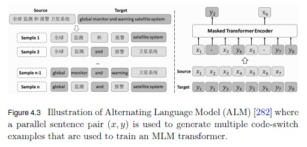

# Multilingual Transformer Architectures


These questions are meant to challenge and expand my understanding of **multilingual transformer architectures**, focusing on **single-encoder** and **dual-encoder models**, along with essential training objectives like **MLM, CLM, and TLM**. They also delve into advanced cross-lingual techniques, including **word recovery**, **contrastive learning**, and **auto-encoding** for improved language alignment.

By tackling these topics, I aim to strengthen my comprehension of how multilingual transformers handle both **monolingual** and **cross-lingual tasks**. This will enhance my grasp of their roles in **natural language understanding** (NLU) and **natural language generation** (NLG).  

---

## Basic Multilingual Transformer
##### What is the role of subword tokenization in the architecture of a Basic Multilingual Transformer, and why is it essential for handling diverse languages effectively?

Subword tokenization is crucial in the architecture of a Basic Multilingual Transformer (BMT) because it splits words into smaller, more meaningful units (like prefixes, suffixes, or character n-grams). This allows the model to handle rare and compound words effectively by representing them through a combination of these subword units, preserving their semantic information. By creating a shared vocabulary of subwords, the model can recognize common patterns across languages, enabling it to generalize better and process multiple languages simultaneously.

This approach is essential for multilingual models because it prevents the need to train separate models for each language. Instead, subword tokenization facilitates cross-lingual transfer, where the model leverages similarities between languages. For example, words with similar roots or affixes across languages can be represented by the same subwords, improving the model’s efficiency and reducing the total vocabulary size.

##### How does a Basic Multilingual Transformer ensure a balanced representation of high-resource and low-resource languages within its shared vocabulary?

In a Basic Multilingual Transformer, ensuring a balanced representation of high-resource and low-resource languages within the shared vocabulary involves more than just adjusting the dataset size. It often begins with strategies like subword tokenization (using methods like BPE, WordPiece, or SentencePiece) that build a vocabulary capable of capturing common subwords across languages, allowing even low-resource languages to have meaningful representations.

To further balance representation, oversampling of low-resource languages and undersampling of high-resource languages is employed during training. This helps prevent the model from being biased toward languages with abundant data. Additionally, techniques such as exponential weighted smoothing are used to prioritize the learning of less-represented languages. By adjusting the sampling probabilities, the model can give more focus to low-resource languages without compromising the overall learning of high-resource languages.


Following the Exponential Weighted Smoothing is explained to get a better undersatnding of its use in Multilingual Models:

- **Purpose**: Adjust sampling probabilities to balance language representation, making the model focus more on low-resource languages.
- **Concept**: EWS reduces the dominance of high-resource languages using an exponential scaling factor ($\alpha$).

**Formula**

```math
p_i = \frac{n_i^\alpha}{\sum_{j} n_j^\alpha}
```

Where:
- $p_i$: Probability of selecting language $i$.
- \( n_i \): Number of sentences for language \( i \).
- \( \alpha \): Smoothing factor.

**Example**

- **Dataset**: 
  - Language A: 10M sentences (high-resource)
  - Language B: 1M sentences (medium-resource)
  - Language C: 100K sentences (low-resource)
- **Original Sampling**:
  - Language A: 91%
  - Language B: 9%
  - Language C: 0.9%
- **New Sampling with \( \alpha = 0.7 \)**:
  - Language A: 
    $
    p_A = \frac{10M^{0.7}}{10M^{0.7} + 1M^{0.7} + 100K^{0.7}} \approx 64\%
    $
  - Language B: 
    $
    p_B = \frac{1M^{0.7}}{10M^{0.7} + 1M^{0.7} + 100K^{0.7}} \approx 25\%
    $
  - Language C: 
    $
    p_C = \frac{100K^{0.7}}{10M^{0.7} + 1M^{0.7} + 100K^{0.7}} \approx 11\%
    $

- Key Benefit: Increases the exposure of low-resource languages, ensuring more balanced training across languages.

##### How does the **Masked Language Model (MLM)** contribute to building robust representations in a Basic Multilingual Transformer, and what are its limitations in capturing context?

The Masked Language Model (MLM) is integral to the Basic Multilingual Transformer, as it trains the model to predict randomly masked tokens in a sentence based on the surrounding context. This forces the model to learn rich, context-aware representations that capture semantic and syntactic relationships across multiple languages. In the multilingual setting, MLM helps create shared linguistic representations that allow for effective cross-lingual transfer, where information learned from one language can improve understanding in another, even if they have different structures or vocabularies. In addition, this model can't use aligned sentences, it means that within the sentence the model just count on with the unmasked tokens and it can't use the same sentence in another language, for example.

However, MLM has limitations when it comes to capturing broader context. Since it focuses on predicting isolated masked tokens, it can struggle with understanding long-range dependencies or global sentence coherence, as it only sees partial context during training. Additionally, because MLM operates at the token level, it might miss subtle nuances or context-specific meanings that could be more apparent with full sentence-level supervision. This can be particularly challenging in multilingual models, where different languages may use different structures to express the same idea.

##### What is the impact of the NSP task on cross-lingual understanding, especially in sentence-level coherence tasks across languages?

The NSP task contributes to sentence-level context by learning associations between consecutive sentences. It works by predicting whether the next sentence is indeed the subsequent one in a sequence, improving the model's ability to understand how sentences relate to one another across languages.

In the training data, half of the sentence pairs are consecutive, while the other half contains random, non-consecutive sentences. This setup helps the model learn to differentiate between natural sentence flow and unrelated sequences, which enhances its understanding of multilingual sentence coherence.

The model applies this learned coherence to tasks such as question answering (QA), natural language inference (NLI), and sentence text similarity (STS), where recognizing logical relationships between sentences is essential.

# Single-Encoder Multilingual NLU

## mBERT
mBERT handles cross-lingual understanding by leveraging a multilingual training process on Wikipedia data across 104 languages. Unlike BERT, which is trained on a single language corpus, mBERT is trained on multilingual data using a shared WordPiece vocabulary that spans all the included languages. This shared vocabulary enables mBERT to learn language-agnostic patterns, capturing universal linguistic features that transcend individual languages and allow it to generalize across them.

Additionally, the training process compensates for data imbalance among languages by oversampling those with fewer Wikipedia pages. This approach ensures that lower-resource languages have a stronger representation during training, improving mBERT’s performance on cross-lingual tasks, even when some languages have more limited data. Through these mechanisms, mBERT can effectively build representations that are useful for cross-lingual understanding, making it suitable for tasks such as zero-shot cross-lingual transfer, where knowledge from one language can be directly applied to another.

##### What are the limitations of mBERT in terms of sentence alignment across languages, and how do these limitations affect its performance on cross-lingual tasks?
As mBERT has the same objectives in the training as the classic BERT model (MLM and SEP) which takes just one sentence at the time to traing itself there's no a real alignment or relationship among languages. That's why mBERT could suffer in some tasks such as Machine Translation and this kinf of downstream tasks exceed its abilities.

Considering that mBERT has downstream tasks such as text classification, natural language inference, NER and QA, it actually does not have a cross-lingual task like Machine Translation for instance and that's because its training was not thought to be used in cross-lingual tasks but in single-language tasks but in different languages.

##### How does the **Next Sentence Prediction (NSP)** objective work in mBERT, and how does it contribute to understanding sentence-level coherence in multilingual settings?

In mBERT, the Next Sentence Prediction (NSP) objective works similarly to how it does in the original BERT model. In this objective, the model is trained to determine whether two sentences appear consecutively in a document or if they are unrelated. Specifically, during training, mBERT receives pairs of sentences, and for each pair, it predicts whether the second sentence logically follows the first. This task helps mBERT learn relationships between sentences, which supports understanding sentence-level coherence and contextual flow.

However, it's worth noting that the NSP objective is applied within each language in mBERT. In other words, sentence pairs used for NSP are drawn from monolingual data, not from parallel sentences across different languages. This limitation means that, while NSP helps mBERT build a sense of coherence and logical flow within individual languages, it does not directly enhance cross-lingual coherence or alignment between languages. NSP aids mBERT’s performance on tasks involving sentence-level relationships within a single language, such as natural language inference or certain QA tasks, but it does not provide explicit training for cross-lingual sentence alignment or translation.
  
## Cross-Lingual Language Model (XLM)
#### How does the introduction of **Translation Language Modeling (TLM)** in XLM improve cross-lingual alignment compared to MLM in mBERT?

TLM enables to learn cross-lingual relationships by mBERT because it uses alignment during training passing the sentences in pairs where the model could use the context of both sentences.

This objective is based on MLM but it introduces the alignment between a pair of sentences to leverage the context of both sentences to predict the masked tokens. for example:

English: "The cat is on the roof."
Spanish: "El gato está en el tejado."

English: "The `[MASK]` is on the `[MASK]`."
Spanish: "El `[MASK]` está en el tejado."

The model’s goal is to predict the missing words based on the entire bilingual context. For the English sentence, it might predict "[MASK]" as "cat" and "[MASK]" as "roof," using the context of both English and Spanish. But, we have to consider that any of the sentence(s) in the pair could be masked either one or two of them. This is appreciated in the following figure of the book:


In a nutshell, XLM improved the mBERT's performance introducing a cross-lingual alignment objective based on the classical MLM.

#### Explain the differences in the use of monolingual and parallel corpora in XLM training, and how they contribute to the model's performance.

XLM uses TLM for cross-lingual learning of the model which employs parallel corpora in the training phase but for single-lingual learning XLM uses the CLM objective which considers one sentence at time and tries to predict the next token in the sequence based just on the previous tokens.

While TLM helps to build relationships among languages to do downstream tasks like Machine Translation, CLM enables XLM to learn better the sequential context of the sequences of tokens for each language. These objectives makes a robust model that is capable of doing more downstream tasks that mBERT and improve the mBERT's performance.

#### In what ways does **Causal Language Modeling (CLM)** enhance the learning of sequential relationships within a single language, and how does it complement TLM in cross-lingual contexts?

Causal Language Modeling (CLM) enhances the learning of sequential relationships by training the model to predict each word based only on the words that came before it, thus creating a strictly left-to-right or autoregressive modeling approach. In CLM, the model learns to generate text one token at a time, developing a strong understanding of sequential dependencies, which is particularly useful for tasks like text generation where the natural flow of language is crucial. By predicting each next word in sequence, the model becomes adept at capturing how ideas and phrases are typically ordered, making it skilled at tasks that rely on fluent, coherent progression within a language.

In cross-lingual contexts, CLM can be combined with Translation Language Modeling (TLM) to enhance cross-lingual learning. TLM is a technique used in multilingual settings, where the model is trained on parallel sentence pairs across languages, effectively learning direct word and phrase mappings between languages. TLM pairs translated sentences from different languages and masks tokens across both, requiring the model to predict masked words based on the corresponding sentence in another language. This setup allows the model to learn alignment and relationships across languages, which is valuable for translation tasks and other cross-lingual applications.

When CLM is paired with TLM in training a model, it strengthens both language-specific sequential knowledge (through CLM) and cross-lingual alignment (through TLM). In practice, this dual approach allows the model to generate text in one language accurately while also understanding cross-lingual structures, which supports tasks requiring both language-specific fluency and cross-lingual transfer. For instance, in multilingual text generation or machine translation, the model benefits from understanding both the native flow of each language (via CLM) and direct relationships between languages (via TLM), making it more versatile and effective across linguistic boundaries.

## XLM-RoBERTa
#### What architectural improvements does XLM-RoBERTa introduce over XLM, and how do these changes enhance multilingual understanding and generalization?

XLM-RoBERTa (XLM-R) introduces several architectural improvements over XLM, primarily through a focus on the Masked Language Modeling (MLM) objective without relying on parallel corpora. By training on 2.5 TB of CommonCrawl data across 100 languages, XLM-R uses a larger, more diverse dataset compared to XLM, which enhances its ability to generalize across languages, particularly for tasks that involve sequence labeling and question answering.

Unlike XLM, which includes Translation Language Modeling (TLM) to leverage parallel text data, XLM-R simplifies training by using only MLM and removing the Language Embeddings of the XLM model. This choice not only makes the model more scalable but also improves its robustness in multilingual contexts, as it doesn’t depend on cross-lingual sentence pairs. XLM-R’s architecture excludes language embeddings, which further enables it to handle code-switching more effectively—a critical aspect when working with multilingual data.

Key contributions of XLM-R include its ability to achieve state-of-the-art performance in multilingual tasks by using monolingual data. The model's success also highlights the importance of high-quality, large-scale data, an expanded vocabulary size, and careful hyperparameter tuning. These improvements over XLM allow XLM-R to deliver strong performance gains over previous multilingual models like mBERT and XLM on complex multilingual tasks, underscoring its advancement in handling diverse linguistic challenges.

#### Why is XLM-RoBERTa particularly effective for low-resource languages compared to its predecessors?

XLM-RoBERTa is particularly effective for low-resource languages because it relies on Masked Language Modeling (MLM) instead of Translation Language Modeling (TLM), which XLM uses. TLM requires parallel, aligned sentence pairs across languages—often unavailable for low-resource languages—whereas MLM allows XLM-RoBERTa to train on monolingual text alone. This flexibility, combined with cleaner and more extensive data, enhances its multilingual embeddings and allows it to generalize well across languages. As a result, XLM-RoBERTa outperforms both XLM and mBERT in low-resource languages and achieves superior results in tasks like sequence labeling and question answering.

## Alternating Language Model (ALM)

#### How does ALM handle multilingual pre-training, and what techniques does it employ to achieve better cross-lingual transfer learning?

The **Alternating Language Model (ALM)** is a pre-training technique designed for cross-lingual representation learning. Unlike traditional translation language models (TLM) that use parallel sentences directly, ALM generates code-switched sentences by swapping phrases between parallel sentences in different languages using. This approach leverages bilingual corpora to create mixed-language data, enabling models to better understand and transfer linguistic patterns across languages. ALM's objective is to improve multilingual language models by training on code-switched sequences, where phrases are selectively swapped between source and target languages, controlled by specific parameters, to enhance cross-lingual comprehension.

To help clarify the Alternating Language Model (ALM) approach, let’s work through an example using the terms and parameters \( a \), \( b \), \( c \), and \( d \) as defined in the provided text.

**Example:**
Imagine we have the following parallel sentence pair:

- **Source sentence** \( x = \{x_1, x_2, x_3, x_4\} \): "I love coffee"
- **Target sentence** \( y = \{y_1, y_2, y_3, y_4\} \): "Me encanta el café"

Now, let’s use the indices \( a \), \( b \), \( c \), and \( d \) to create a code-switched sequence. According to the document:

1. \( a \) and \( b \) define the range of tokens in the **source sentence** \( x \).
2. \( c \) and \( d \) define the range of tokens in the **target sentence** \( y \).

These indices allow us to "swap" phrases or segments between the two sentences in a controlled way. Here’s how we might set them in our example:

**Setting Values for \( a \), \( b \), \( c \), and \( d \)**
Let’s choose:

- \( a = 1 \) and \( b = 2 \) — this means we will use tokens from \( x_1 \) to \( x_2 \) in the source sentence \( x \).
- \( c = 3 \) and \( d = 4 \) — this means we will use tokens from \( y_3 \) to \( y_4 \) in the target sentence \( y \).

**Code-Switched Sequence Generation**
Using these indices, we create a code-switched sequence by selecting and merging parts from both sentences.

1. Take the segment from \( x \) using tokens from \( x_1 \) to \( x_2 \): **"I love"**.
2. Take the segment from \( y \) using tokens from \( y_3 \) to \( y_4 \): **"el café"**.

The resulting **code-switched sequence** \( u \) could be:
- **"I love el café"**

**Interpretation of \( \alpha \) (Mixing Ratio)**
The value \( \alpha \) determines the proportion of tokens from the source vs. the target sentence in the code-switched sequence. 

- If \( \alpha = 1 \): We would use only tokens from the source sentence, so the code-switched sequence would be just \( x \) ("I love coffee").
- If \( \alpha = 0 \): We would use only tokens from the target sentence, so the sequence would be just \( y \) ("Me encanta el café").
- For \( 0 < \alpha < 1 \): We get a mix of both, as shown in the example above ("I love el café").

In ALM, the training objective is to maximize the likelihood of predicting the masked tokens in this code-switched sentence using a masked language modeling (MLM) loss. For example, if we mask "love" in "I love el café," the model should learn to predict "love" based on context.

The loss function \( \mathcal{L}_{\text{ALM}}^{(x,y)} \) sums the log probabilities of correctly predicting each masked token in the code-switched sentence \( z \) (here, "I [MASK] el café") over a set of masked positions \( M \).

The goal of ALM is to help a model learn from mixed-lingual context, improving its ability to generalize across languages.

The following figure shows how ALM works using the source and target sequences (sentences in this case) and how a pair of sentences can generate multiple samples to train the model:



#### In what ways does ALM address the challenges of data imbalance across languages during training?

Considering the parallel corpora and the kind of task used during training, I think that the challenge of imbalance data across languages is mitigated by increasing the exposure of the low-resource languages via code-switched sequences of tokens, so it's a kind of data augmentation because to the same sentence but with different ratios we could handle multiple iterations wih different masked tokens (`[MASK]`) that makes the model more robust in these low-resource languages.

## Unicoder

#### Cross-lingual Word Recovery (CLWR)
- How does CLWR refine the alignment of word embeddings across languages, and why is it critical for translation-based tasks?

First, I'll explain what CLWR is and how it works in the Unicoder. In addition, consider that I used the paper [Unicoder: A Universal Language Encoder by Pre-training with Multiple Cross-lingual Tasks](https://arxiv.org/abs/1909.00964) which belongs to the original paper about the Unicoder developed by Microsoft.


In a nutshell, the *CLWR* is a task that consider...

#### Cross-lingual Paraphrase Classification (CLPC)
- In what ways does CLPC help models distinguish between paraphrases in different languages, and how does it impact semantic similarity tasks?

#### Cross-lingual Masked LM (CLMLM)
- What are the advantages of using CLMLM over standard MLM in achieving better cross-lingual word prediction?

#### What is the significance of leveraging additional cross-lingual supervision signals in Unicoder, and how does it differ from standard MLM objectives?


#### How does Unicoder ensure both monolingual and cross-lingual effectiveness in downstream tasks?


#### How does Unicoder integrate **Cross-lingual Word Alignment (CLWA)** to refine word-level embeddings across languages?

## INFOXLM
- What techniques does INFOXLM introduce to enhance cross-lingual natural language understanding, and how do they affect representation alignment?
- How does INFOXLM integrate information retrieval signals with cross-lingual training, and why is this beneficial?
- What is the role of **Cross-lingual Sentence Alignment (CLSA)** in INFOXLM, and how does it improve the model's performance in tasks like translation and multilingual classification?

#### AMBER
- How does AMBER extend the single-encoder architecture to improve semantic understanding across languages?
- Discuss the training strategies used by AMBER to balance language representation across high-resource and low-resource languages.
- How does **Cross-lingual Contrastive Learning (XLCO)** contribute to AMBER's ability to differentiate semantically similar and dissimilar sentences across languages?

#### ERNIE-M
- What specific strategies does ERNIE-M use to achieve improved cross-lingual representation and semantic alignment?
- How does ERNIE-M incorporate knowledge into its training process, and why is this advantageous for cross-lingual tasks?
- Explain how **Cross-lingual Paraphrase Classification (CLPC)** is used in ERNIE-M to refine the model’s ability to detect paraphrases across languages.

#### HITCL
- What is HITCL, and how does it handle high-level representation alignment across languages?
- How does HITCL utilize contrastive learning for better cross-lingual understanding, and what challenges does this approach address?
- In what ways does **Cross-lingual Word Recovery (CLWR)** assist HITCL in learning more precise word-level alignments?

### Dual-Encoder Multilingual NLU

#### LaBSE
- How does LaBSE differ from single-encoder models in terms of sentence embedding generation and cross-lingual retrieval?
- What challenges does LaBSE face when aligning multilingual embeddings, and how are they mitigated in its architecture?
- How does LaBSE utilize the **Bidirectional Dual Encoder with Additive Margin Softmax** to improve retrieval performance across languages?

#### mUSE
- Explain how mUSE employs dual-encoder architecture to handle cross-lingual semantic similarity tasks.
- What makes mUSE suitable for tasks like semantic search and cross-lingual question-answering compared to other multilingual models?
- How does mUSE leverage **Sequence-to-Sequence LM (Seq2SeqLM)** for tasks that involve generating responses in different languages?

### Multilingual NLG
- What are the primary differences between multilingual natural language generation (NLG) and natural language understanding (NLU) models?
- How does a multilingual NLG model handle the diversity of languages in terms of grammar, sentence structure, and semantic consistency across generated outputs?
- How does the **Denoising Auto-Encoder (DAE)** technique contribute to the robustness of multilingual NLG models in handling noisy input?
- In what ways does **Cross-lingual Auto-Encoding (XAE)** help multilingual NLG models in learning consistent cross-lingual generation patterns?

### Cross-Lingual Techniques

#### Masked Language Model (MLM)
- How does MLM perform in cross-lingual settings, and what are the limitations of using MLM alone for multilingual representation alignment?

#### Next Sentence Prediction (NSP)
- What is the impact of the NSP task on cross-lingual understanding, especially in sentence-level coherence tasks across languages?

#### Causal Language Modeling (CLM)
- How does CLM enhance sequential language modeling within a monolingual context, and why is it important for building foundational representations?

#### Translation Language Model (TLM)
- How does TLM utilize parallel corpora to improve token prediction, and what specific benefits does it offer over MLM in cross-lingual training scenarios?

#### Cross-lingual Contrastive Learning (XLCO)
- How does XLCO improve the representation of multilingual embeddings by focusing on contrasting similar and dissimilar pairs?

#### Cross-lingual Word Alignment (CLWA)
- What role does CLWA play in fine-tuning word-level embeddings, and how does it enhance translation quality?

#### Cross-lingual Sentence Alignment (CLSA)
- How does CLSA contribute to sentence-level representation alignment, and what benefits does it provide in cross-lingual retrieval tasks?

#### Cross-attention Masked LM (CAMLM)
- How does CAMLM incorporate cross-attention mechanisms for better token prediction across languages?

#### Back Translation Masked Language Modeling (BTMLM)
- How does BTMLM utilize back translation to improve language modeling, and what advantages does it provide for generating multilingual text?

#### Bidirectional Dual Encoder with Additive Margin Softmax
- What is the role of additive margin softmax in improving cross-lingual retrieval accuracy in models like LaBSE?

#### Sequence-to-Sequence LM (Seq2SeqLM)
- How does Seq2SeqLM facilitate cross-lingual generation tasks, and what challenges does it address in multilingual NLG?

#### Denoising Auto-Encoder (DAE)
- How does DAE handle noise in multilingual inputs, and why is it crucial for enhancing text generation in NLG models?

#### Cross-lingual Auto-Encoding (XAE)
- How does XAE support cross-lingual training by reconstructing masked or corrupted input across different languages?
