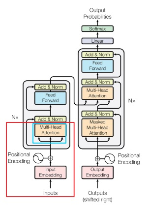
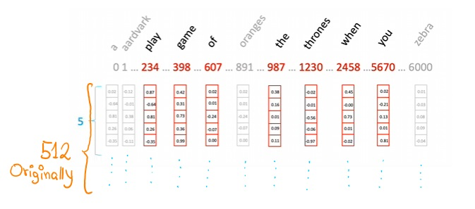
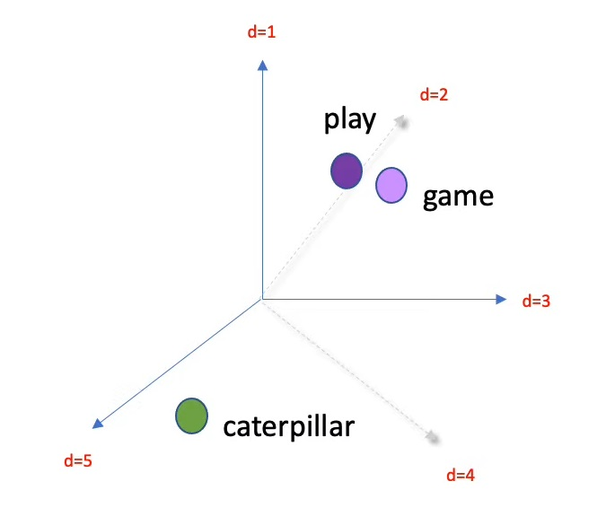

# "Attention Is All You Need"

These are challenging questions to test the understanding of the "Attention Is All You Need" paper:

### **Why did the authors move away from RNNs and CNNs, and how does the attention mechanism address the limitations of those models?**
- The authors move away from RNNs and CNNs mainly because those models had a limitation of large contexts (they use text to illustrate the point), therefore when those models were applied in scenarios such as translation they saw an opportunity to improve the state-of-the-art models.
- Another reason was the non-parallelizable flow of the state-of-the-art models because they had sequential hidden states where function h(t) in the moment t depends on the previous state h_(t-1). This parallelizable nature of the sequential models becomes a challenge when large size batches or long sequences need to be processed for one of these models.

### Explain in detail how the self-attention mechanism works in the Transformer. How does it compute the attention scores, and how are those scores used in the model?
In the following image we see the Transfomer architecture. But, for now we focus on the red and lightblue boxes where the first one contains the self-attention mechanism (embedded within the Multi-Head attention) and the previous steps from the raw input to the positional encoding.

So, I'm going to explain the self-attention mechanism considering all the process since the input (red box in previous image) to a better understanding but I'm going to divide in two sections to separate the input process and the self-attention machanism.

* **Inputs**
    Pass the text to the input, *"When you play the games of thrones"* and we expect *"you win or you die"* for example. Indeed in this is a process we pass our corpus to the transformer.  

    > The transformer analyzes our corpus and define a *vocabulary* in a way that each word of our corpus has a index value, something like dictionaries in Python.  

    Still in the input the transformer takes our sentence and format it to its vocabulary indices. To continue with the example, we had the sentence "When you play the game of thrones" and now we would have `[ 2458 5670 234 987 398 607 1230 ]` where if we represent each token with X_{i} we also have $[x_{0}, x_{1}, x_{2}, x_{3}, x_{4}, x_{5}, x_{6}, x_{7}]$.  

* **Input Embeddings**
    In this step the transformer assigns a embedding to each word with 512 dimensions according to the original paper, but for demostrative purposes I'm using a reduced version of just 5 dimensions.

    

    Here, we have to understand that each those embeddings are trainable and when they are fitted to our data each dimension represent a **linguistic feature**. In addition, these embeddings give context to the words and make them distinguishable, as in our context of Game of Thrones.

    

* **Positional Encoding**
    Some stuff

1. In the Transformer architecture, self-attention mechanisms internally uses three key components which are the query (Q), key (K) and value (V). These components are the same matrix at the input to the self-attention mechanism and this matrix is the result of 
So, Q and K are used to compute the Attention filter (a matrix of nxm) which begins with almost random values but as long as it is trained its weights capture the most relevant parts of the sequence. Then, the Attention filter is combined with V 

### What is the purpose of the multi-head attention mechanism, and why is it more effective than using a single attention head? Can you describe the intuition behind it?

### How does positional encoding function in the Transformer model? Why is it necessary, and what kind of information does it capture?

### The paper claims that the Transformer architecture allows for more parallelization compared to RNNs. How does this parallelization happen, and why does it improve training efficiency?

### In the encoder-decoder architecture of the Transformer, what roles do the encoder and decoder play, and how do they interact through the attention mechanism?

### Why is the scaled dot-product attention used in the Transformer, and how does the scaling factor improve the performance of the model?

### What is the purpose of the residual connections and layer normalization in the Transformer architecture, and how do they contribute to model performance?

### What are the key hyperparameters that affect the performance of a Transformer model, and how might changing these hyperparameters (like the number of heads or the size of the feedforward network) impact the results?

### Compare the Transformer’s approach to sequence-to-sequence modeling with the traditional encoder-decoder approach using LSTMs. What are the advantages and potential limitations of the Transformer model in certain applications?
