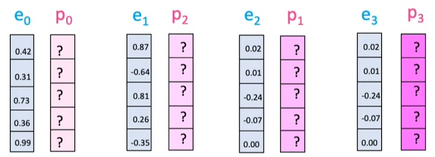
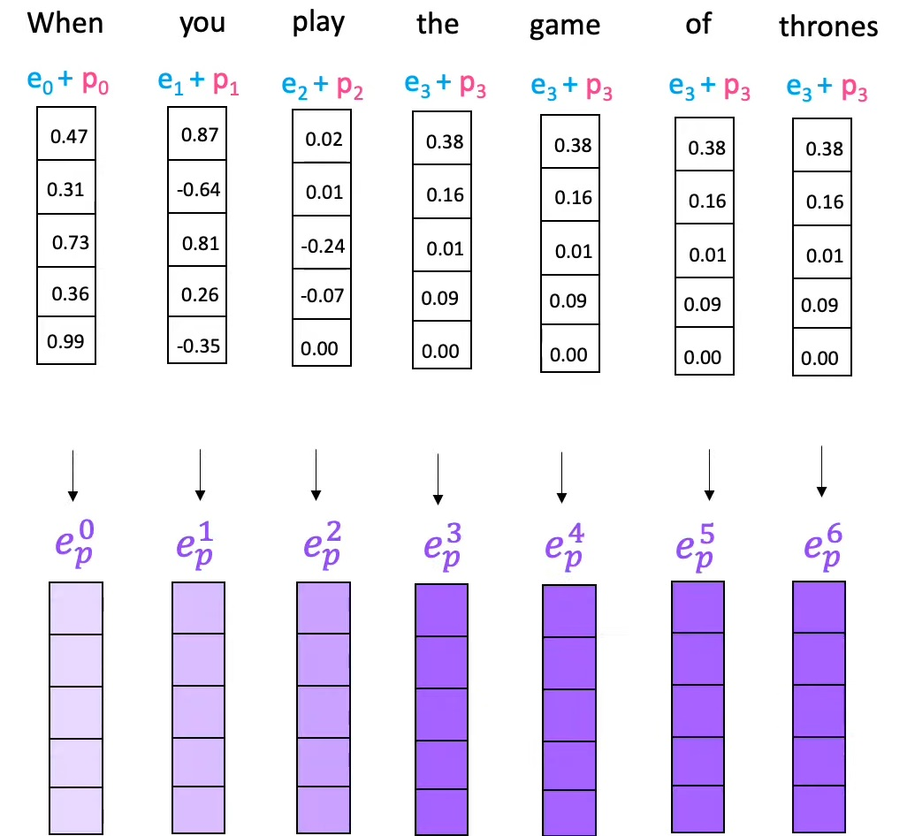
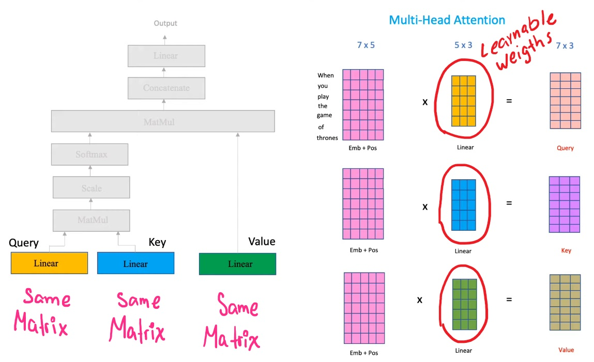
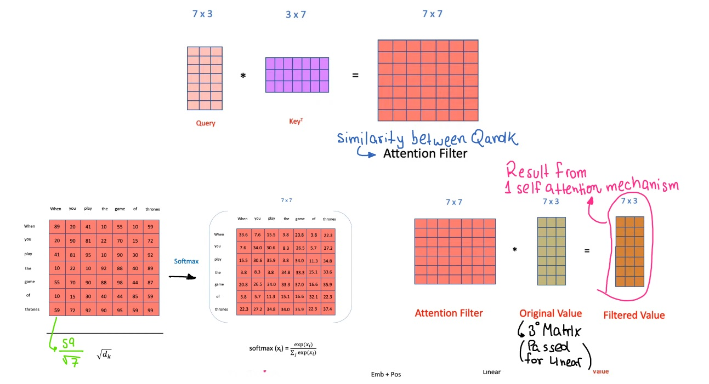
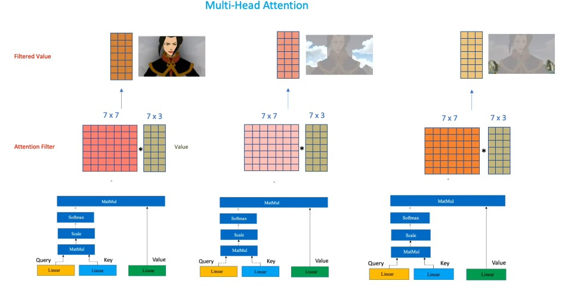
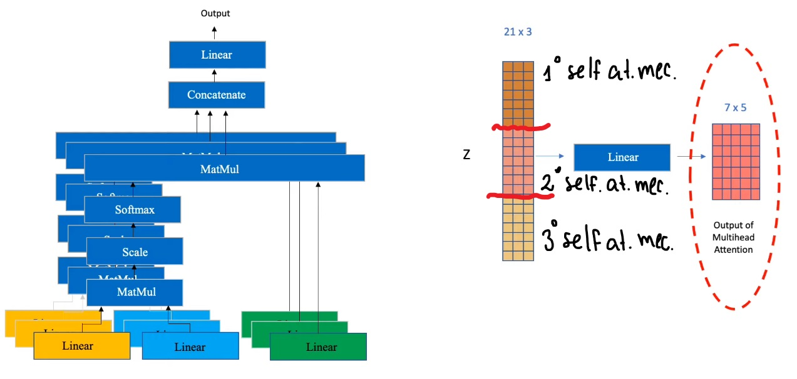
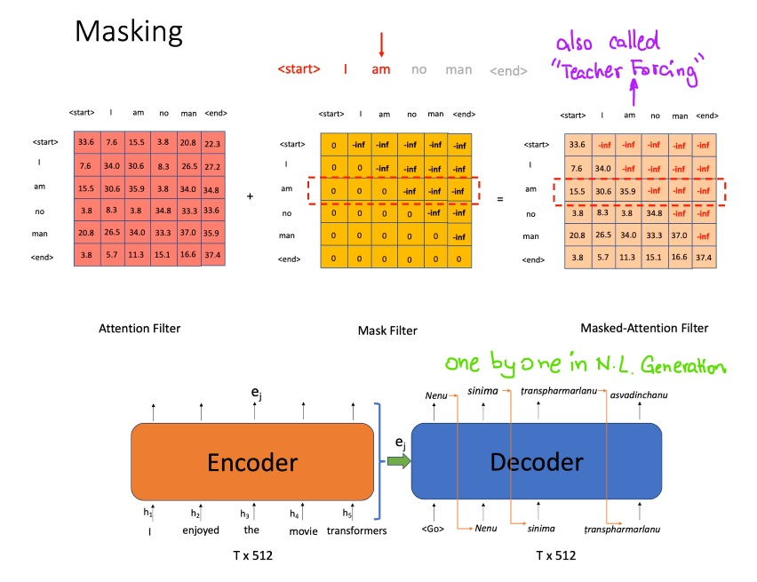

# "Attention Is All You Need"

These are challenging questions to test the understanding of the "Attention Is All You Need" paper:

### **Why did the authors move away from RNNs and CNNs, and how does the attention mechanism address the limitations of those models?**
- The authors move away from RNNs and CNNs mainly because those models had a limitation of large contexts (they use text to illustrate the point), therefore when those models were applied in scenarios such as translation they saw an opportunity to improve the state-of-the-art models.
- Another reason was the non-parallelizable flow of the state-of-the-art models because they had sequential hidden states where function $h_{t}$ in the moment t depends on the previous state $h_{t-1}$. This parallelizable nature of the sequential models becomes a challenge when large size batches or long sequences need to be processed for one of these models.

---

### Explain in detail how the self-attention mechanism works in the Transformer. How does it compute the attention scores, and how are those scores used in the model?
In the following image we see the Transfomer architecture. But, for now we focus on the red and lightblue boxes where the first one contains the self-attention mechanism (embedded within the Multi-Head attention) and the previous steps from the raw input to the positional encoding.

So, I'm going to explain the self-attention mechanism considering all the process since the input (red box in previous image) to a better understanding but I'm going to divide in two sections to separate the input process and the self-attention machanism.

* **Inputs**
    Pass the text to the input, *"When you play the games of thrones"* and we expect *"you win or you die"* for example. Indeed in this is a process we pass our corpus to the transformer.  

    > The transformer analyzes our corpus and define a *vocabulary* in a way that each word of our corpus has a index value, something like dictionaries in Python.  

    Still in the input the transformer takes our sentence and format it to its vocabulary indices. To continue with the example, we had the sentence "When you play the game of thrones" and now we would have `[ 2458 5670 234 987 398 607 1230 ]` where if we represent each token with X_{i} we also have $[x_{0}, x_{1}, x_{2}, x_{3}, x_{4}, x_{5}, x_{6}, x_{7}]$.  

* **Input Embeddings**
    In this step the transformer assigns a embedding to each word with 512 dimensions according to the original paper, but for demostrative purposes I'm using a reduced version of just 5 dimensions.

    

    Here, we have to understand that each those embeddings are trainable and when they are fitted to our data each dimension represent a **linguistic feature**. In addition, these embeddings give context to the words and make them distinguishable, as in our context of Game of Thrones.

    

* **Positional Encoding**
    Since the transformer doesn't use covolutions or states to capture the order of the sequential data, its way to capture the order is through positional encoding.
    So, now we have our word embedding and an additional vector for each token, just like this:

    

    Now, the transformer will apply two formulas to each value considering the position of the token. For example, te first token or word has a position = 0 and the second token has a position = 1.  
      
    * $PE_{(pos, 2i)} = \sin\left( \frac{pos}{10000^{\frac{2i}{d}}} \right)$
    * $PE_{(pos, 2i+1)} = \cos\left( \frac{pos}{10000^{\frac{2i}{d}}} \right)$

    > Zero dimension, and the following pair dimensions use $sine()$ and the unpair dimensions use the $cosine()$ formula.

    These formulas are implemented in this way for the first token, by example:

    

    Finally, the embedding vector and the positional encoding vector are added into just one vector which pass to the *Self-attention mechanism*.

    

    > Little note: In some posts the position beggins with a 0 index but others use a position of 1, so the paper does not mention which one specifically use but there are those two options. I think that the the performance with any of them woul be very very similar, by the way.

* ***Self-Attention Mechanism:***
    The *self-attention mechanism* beggins with a linear layer for its three components which are the Query (Q), Key (K) and Value (V).  
    Each one of this components passes through a linear transformation and generates three new and different matrices.

    

    Then, a matrix multiplication is calculated between the Q and K matrices. This result matrix represents the similarity between the Query and the Key and after be computed is divided by $\sqrt{d_{k}}$ and then is processed by a softmax function.  
    After the softmax processing, the attention filter is multiplied by the "original Value V" (this is almost equal to the initial matrix because it was already passed through a linear layer) and the result is the *Filtered Value* which is a matrix with the weighted tokens.

    

    Each *Filtered Value* focuses in different aspects of the sequence. In this example each one focusses in the subject, sky and ground of the same image and this behaviour is the same for text data.

    

    At the end of the calculation of each Filtered Value (which is the result of each *self-attention* mechanism) all those matrices are concatenated in a vertical way to be passed through a linear layer again. So, this final matrix is the result of the multiple self-attention mechanism which are called multi-head attention when they act as a group.

    

    **Note:** The decoder uses **masked** multi-head attention which is a group a self-attention mechanisms which basically hide the next tokens for each actual token in the generating tokens process of the decoder. This process is also called **Teacher Forcing**.  

    Example: The decoder has to generate the sentence "May the force be with you" and it already generated the "May the force" part, so it has to generate the token "be" now. The mask effect makes that the decoder can only see the previous tokens for the generation of its actual prediction token, so in this case it just will see "May the force" when it's trying to generate the "be" token.

    

> For this detailed explanation I use this awesome resource: [Transfomer architecture](https://www.youtube.com/watch?v=mMa2PmYJlCo&t=322s&ab_channel=HeduAIbyBatoolHaider)

---

### What is the purpose of the multi-head attention mechanism, and why is it more effective than using a single attention head? Can you describe the intuition behind it?

- The *Transformer* uses multi-head attention mechanism because each one of the self-attention mechanism looks a different characteristics of the sequence, that's why multi-head attention mechanism turns out to be a more robust approach.
- The intuition, in context of images just for convenience, is that each self-attention mechanism will focus in different aspects of the images to return a better matrix of attention. One of them could focus on the background of the photos, but another one could focus on the people that appears and another one could focus on the ground, weather, sky, etc. But, when all of them are grouped the final matrix of attention consider more than just one feature of the images because each component of the multi-head attention mechanism focused in different regions of the images.

---

### How does positional encoding function in the Transformer model? Why is it necessary, and what kind of information does it capture?

> Resource: [Amirhossein Kazemnejad's Blog](https://kazemnejad.com/blog/transformer_architecture_positional_encoding/)

- The positional encoding in the *Transformer* is applied by using sine and cosine functions to each token position:

> In the image, the indices beggins with 1, but in the original paper the authors does not mention that the indices beggins with it or with 0.

- Sine and cosine functions were selected by the authors for these reasons:
    - Both of them are uncorrelated functions so the use of them helps the model to learn a better (and complex) representation of the sequence.
    - These function helps to understand the order of each token realtive to their sequence, so the model would generalize better although the input was a short or a long sequence.

---

### The paper claims that the Transformer architecture allows for more parallelization compared to RNNs. How does this parallelization happen, and why does it improve training efficiency?

- This parallelization happens because the sequence is not going to be processed sequentially but in one shot process for each iteration in the training phase.
- It improves the training efficiency because each iteration is faster and needs less computational resources. In addition, these iprovements comes with a better performance.

---

### In the encoder-decoder architecture of the Transformer, what roles do the encoder and decoder play, and how do they interact through the attention mechanism?

- The encoder role is to analyze the inputs and determine a matrix that give the capacity of weigh the context in the sequences of the input. That matrix later will be used for the decoder to prioritize some parts of the sequences.

- The encoder generates a *attention matrix* which is used for the decoder and that's how the decoder weigh its input sequence (labels) to learn the task.

---

### Why is the scaled dot-product attention used in the Transformer, and how does the scaling factor improve the performance of the model?

- The scaled dot product is used for two things. The first one is to create the attention matrix which is the dot-product result of the Query (Q) and Key (K) that is used to find similarities between them. On the other hand, the scaling helps to distribute in a better way the weights of the attention matrix and prevent the vanishing gradient problem because the scaling make more robust the processing in the softmax function therefore the attention matrix could have very large numbers.
- The softmax function is a different but visually similar function to the sigmoid function which suffers of the vanishing gradient problem too. Look at this visual comparison.

- This scaling help to avoid an old problem in Deep Learning where the scientists realized that the sigmoid function in deeper neural networks suffers of vanishing gradient problem and they started to use other activation functions such as ReLU or $tanh()$.

---

### What is the purpose of the residual connections and layer normalization in the Transformer architecture, and how do they contribute to model performance?

- Resodual connections in the *Transformer* architecture is because with the forward propagation the initial information of the positional encodings is going to be vanished over the layers. So, to avoid this problem the model architecture passes this information again to the model.
- The architecture has 5 residual connections:

---

### Compare the Transformer’s approach to sequence-to-sequence modeling with the traditional encoder-decoder approach using LSTMs. What are the advantages and potential limitations of the Transformer model in certain applications?

- Transformer overall requires a high computational capacity and larger datasets to outperform as the user expects. So, for that reason some of the limitations are the associated costs, the data source to take advantage of this architecture and the risk of overfitting when the user trains its transformer with small datasets.
