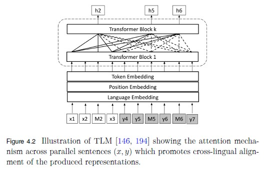
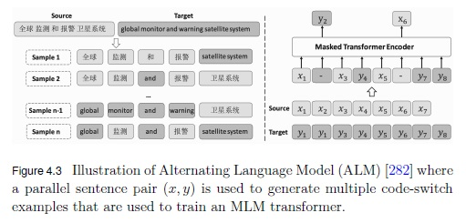
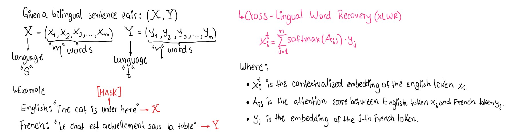
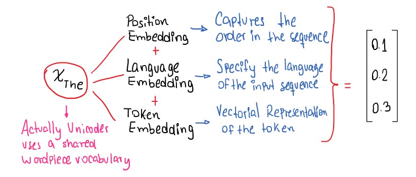
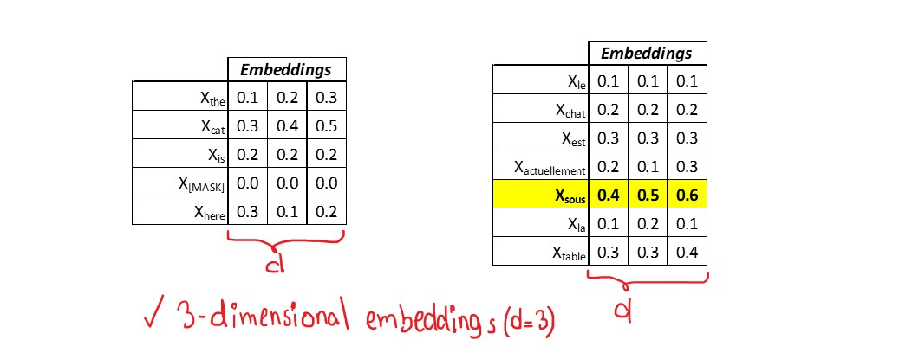
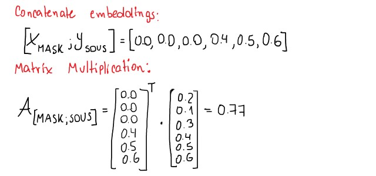
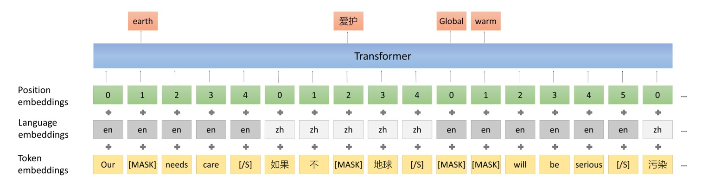
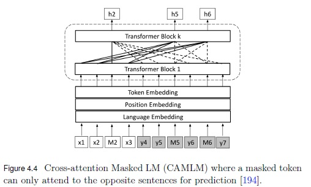
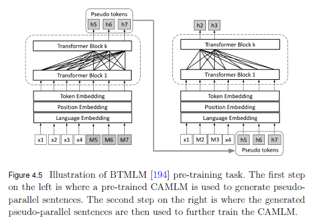
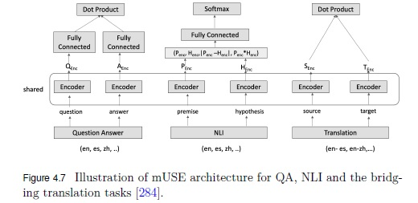

# Multilingual Transformer Architectures


These questions are meant to challenge and expand my understanding of **multilingual transformer architectures**, focusing on **single-encoder** and **dual-encoder models**, along with essential training objectives like **MLM, CLM, and TLM**. They also delve into advanced cross-lingual techniques, including **word recovery**, **contrastive learning**, and **auto-encoding** for improved language alignment.

By tackling these topics, I aim to strengthen my comprehension of how multilingual transformers handle both **monolingual** and **cross-lingual tasks**. This will enhance my grasp of their roles in **natural language understanding** (NLU) and **natural language generation** (NLG).  

---

# Basic Multilingual Transformer
##### What is the role of subword tokenization in the architecture of a Basic Multilingual Transformer, and why is it essential for handling diverse languages effectively?

Subword tokenization is crucial in the architecture of a Basic Multilingual Transformer (BMT) because it splits words into smaller, more meaningful units (like prefixes, suffixes, or character n-grams). This allows the model to handle rare and compound words effectively by representing them through a combination of these subword units, preserving their semantic information. By creating a shared vocabulary of subwords, the model can recognize common patterns across languages, enabling it to generalize better and process multiple languages simultaneously.

This approach is essential for multilingual models because it prevents the need to train separate models for each language. Instead, subword tokenization facilitates cross-lingual transfer, where the model leverages similarities between languages. For example, words with similar roots or affixes across languages can be represented by the same subwords, improving the model’s efficiency and reducing the total vocabulary size.

##### How does a Basic Multilingual Transformer ensure a balanced representation of high-resource and low-resource languages within its shared vocabulary?

In a Basic Multilingual Transformer, ensuring a balanced representation of high-resource and low-resource languages within the shared vocabulary involves more than just adjusting the dataset size. It often begins with strategies like subword tokenization (using methods like BPE, WordPiece, or SentencePiece) that build a vocabulary capable of capturing common subwords across languages, allowing even low-resource languages to have meaningful representations.

To further balance representation, oversampling of low-resource languages and undersampling of high-resource languages is employed during training. This helps prevent the model from being biased toward languages with abundant data. Additionally, techniques such as exponential weighted smoothing are used to prioritize the learning of less-represented languages. By adjusting the sampling probabilities, the model can give more focus to low-resource languages without compromising the overall learning of high-resource languages.


Following the Exponential Weighted Smoothing is explained to get a better undersatnding of its use in Multilingual Models:

- **Purpose**: Adjust sampling probabilities to balance language representation, making the model focus more on low-resource languages.
- **Concept**: EWS reduces the dominance of high-resource languages using an exponential scaling factor ($\alpha$).

**Formula**

```math
p_i = \frac{n_i^\alpha}{\sum_{j} n_j^\alpha}
```

Where:
- $p_i$: Probability of selecting language $i$.
- $n_i$: Number of sentences for language $i$.
- $\alpha$): Smoothing factor.

**Example**

- **Dataset**: 
  - Language A: 10M sentences (high-resource)
  - Language B: 1M sentences (medium-resource)
  - Language C: 100K sentences (low-resource)
- **Original Sampling**:
  - Language A: 91%
  - Language B: 9%
  - Language C: 0.9%
- **New Sampling with $\alpha = 0.7$**:
  - Language A: 
    $$p_A = \frac{10M^{0.7}}{10M^{0.7} + 1M^{0.7} + 100K^{0.7}} \approx 64\%$$
  - Language B: 
    $$p_B = \frac{1M^{0.7}}{10M^{0.7} + 1M^{0.7} + 100K^{0.7}} \approx 25\%$$
  - Language C: 
    $$p_C = \frac{100K^{0.7}}{10M^{0.7} + 1M^{0.7} + 100K^{0.7}} \approx 11\%$$


- Key Benefit: Increases the exposure of low-resource languages, ensuring more balanced training across languages.

##### How does the **Masked Language Model (MLM)** contribute to building robust representations in a Basic Multilingual Transformer, and what are its limitations in capturing context?

The Masked Language Model (MLM) is integral to the Basic Multilingual Transformer, as it trains the model to predict randomly masked tokens in a sentence based on the surrounding context. This forces the model to learn rich, context-aware representations that capture semantic and syntactic relationships across multiple languages. In the multilingual setting, MLM helps create shared linguistic representations that allow for effective cross-lingual transfer, where information learned from one language can improve understanding in another, even if they have different structures or vocabularies. In addition, this model can't use aligned sentences, it means that within the sentence the model just count on with the unmasked tokens and it can't use the same sentence in another language, for example.

However, MLM has limitations when it comes to capturing broader context. Since it focuses on predicting isolated masked tokens, it can struggle with understanding long-range dependencies or global sentence coherence, as it only sees partial context during training. Additionally, because MLM operates at the token level, it might miss subtle nuances or context-specific meanings that could be more apparent with full sentence-level supervision. This can be particularly challenging in multilingual models, where different languages may use different structures to express the same idea.

##### What is the impact of the NSP task on cross-lingual understanding, especially in sentence-level coherence tasks across languages?

The NSP task contributes to sentence-level context by learning associations between consecutive sentences. It works by predicting whether the next sentence is indeed the subsequent one in a sequence, improving the model's ability to understand how sentences relate to one another across languages.

In the training data, half of the sentence pairs are consecutive, while the other half contains random, non-consecutive sentences. This setup helps the model learn to differentiate between natural sentence flow and unrelated sequences, which enhances its understanding of multilingual sentence coherence.

The model applies this learned coherence to tasks such as question answering (QA), natural language inference (NLI), and sentence text similarity (STS), where recognizing logical relationships between sentences is essential.

# Single-Encoder Multilingual NLU

## mBERT
mBERT handles cross-lingual understanding by leveraging a multilingual training process on Wikipedia data across 104 languages. Unlike BERT, which is trained on a single language corpus, mBERT is trained on multilingual data using a shared WordPiece vocabulary that spans all the included languages. This shared vocabulary enables mBERT to learn language-agnostic patterns, capturing universal linguistic features that transcend individual languages and allow it to generalize across them.

Additionally, the training process compensates for data imbalance among languages by oversampling those with fewer Wikipedia pages. This approach ensures that lower-resource languages have a stronger representation during training, improving mBERT’s performance on cross-lingual tasks, even when some languages have more limited data. Through these mechanisms, mBERT can effectively build representations that are useful for cross-lingual understanding, making it suitable for tasks such as zero-shot cross-lingual transfer, where knowledge from one language can be directly applied to another.

##### What are the limitations of mBERT in terms of sentence alignment across languages, and how do these limitations affect its performance on cross-lingual tasks?
As mBERT has the same objectives in the training as the classic BERT model (MLM and SEP) which takes just one sentence at the time to traing itself there's no a real alignment or relationship among languages. That's why mBERT could suffer in some tasks such as Machine Translation and this kinf of downstream tasks exceed its abilities.

Considering that mBERT has downstream tasks such as text classification, natural language inference, NER and QA, it actually does not have a cross-lingual task like Machine Translation for instance and that's because its training was not thought to be used in cross-lingual tasks but in single-language tasks but in different languages.

##### How does the **Next Sentence Prediction (NSP)** objective work in mBERT, and how does it contribute to understanding sentence-level coherence in multilingual settings?

In mBERT, the Next Sentence Prediction (NSP) objective works similarly to how it does in the original BERT model. In this objective, the model is trained to determine whether two sentences appear consecutively in a document or if they are unrelated. Specifically, during training, mBERT receives pairs of sentences, and for each pair, it predicts whether the second sentence logically follows the first. This task helps mBERT learn relationships between sentences, which supports understanding sentence-level coherence and contextual flow.

However, it's worth noting that the NSP objective is applied within each language in mBERT. In other words, sentence pairs used for NSP are drawn from monolingual data, not from parallel sentences across different languages. This limitation means that, while NSP helps mBERT build a sense of coherence and logical flow within individual languages, it does not directly enhance cross-lingual coherence or alignment between languages. NSP aids mBERT’s performance on tasks involving sentence-level relationships within a single language, such as natural language inference or certain QA tasks, but it does not provide explicit training for cross-lingual sentence alignment or translation.
  
## Cross-Lingual Language Model (XLM)
#### How does the introduction of **Translation Language Modeling (TLM)** in XLM improve cross-lingual alignment compared to MLM in mBERT?

TLM enables to learn cross-lingual relationships by mBERT because it uses alignment during training passing the sentences in pairs where the model could use the context of both sentences.

This objective is based on MLM but it introduces the alignment between a pair of sentences to leverage the context of both sentences to predict the masked tokens. for example:

English: "The cat is on the roof."
Spanish: "El gato está en el tejado."

English: "The `[MASK]` is on the `[MASK]`."
Spanish: "El `[MASK]` está en el tejado."

The model’s goal is to predict the missing words based on the entire bilingual context. For the English sentence, it might predict "[MASK]" as "cat" and "[MASK]" as "roof," using the context of both English and Spanish. But, we have to consider that any of the sentence(s) in the pair could be masked either one or two of them. This is appreciated in the following figure of the book:



In a nutshell, XLM improved the mBERT's performance introducing a cross-lingual alignment objective based on the classical MLM.

#### Explain the differences in the use of monolingual and parallel corpora in XLM training, and how they contribute to the model's performance.

XLM uses TLM for cross-lingual learning of the model which employs parallel corpora in the training phase but for single-lingual learning XLM uses the CLM objective which considers one sentence at time and tries to predict the next token in the sequence based just on the previous tokens.

While TLM helps to build relationships among languages to do downstream tasks like Machine Translation, CLM enables XLM to learn better the sequential context of the sequences of tokens for each language. These objectives makes a robust model that is capable of doing more downstream tasks that mBERT and improve the mBERT's performance.

#### In what ways does **Causal Language Modeling (CLM)** enhance the learning of sequential relationships within a single language, and how does it complement TLM in cross-lingual contexts?

Causal Language Modeling (CLM) enhances the learning of sequential relationships by training the model to predict each word based only on the words that came before it, thus creating a strictly left-to-right or autoregressive modeling approach. In CLM, the model learns to generate text one token at a time, developing a strong understanding of sequential dependencies, which is particularly useful for tasks like text generation where the natural flow of language is crucial. By predicting each next word in sequence, the model becomes adept at capturing how ideas and phrases are typically ordered, making it skilled at tasks that rely on fluent, coherent progression within a language.

In cross-lingual contexts, CLM can be combined with Translation Language Modeling (TLM) to enhance cross-lingual learning. TLM is a technique used in multilingual settings, where the model is trained on parallel sentence pairs across languages, effectively learning direct word and phrase mappings between languages. TLM pairs translated sentences from different languages and masks tokens across both, requiring the model to predict masked words based on the corresponding sentence in another language. This setup allows the model to learn alignment and relationships across languages, which is valuable for translation tasks and other cross-lingual applications.

When CLM is paired with TLM in training a model, it strengthens both language-specific sequential knowledge (through CLM) and cross-lingual alignment (through TLM). In practice, this dual approach allows the model to generate text in one language accurately while also understanding cross-lingual structures, which supports tasks requiring both language-specific fluency and cross-lingual transfer. For instance, in multilingual text generation or machine translation, the model benefits from understanding both the native flow of each language (via CLM) and direct relationships between languages (via TLM), making it more versatile and effective across linguistic boundaries.

## XLM-RoBERTa
#### What architectural improvements does XLM-RoBERTa introduce over XLM, and how do these changes enhance multilingual understanding and generalization?

XLM-RoBERTa (XLM-R) introduces several architectural improvements over XLM, primarily through a focus on the Masked Language Modeling (MLM) objective without relying on parallel corpora. By training on 2.5 TB of CommonCrawl data across 100 languages, XLM-R uses a larger, more diverse dataset compared to XLM, which enhances its ability to generalize across languages, particularly for tasks that involve sequence labeling and question answering.

Unlike XLM, which includes Translation Language Modeling (TLM) to leverage parallel text data, XLM-R simplifies training by using only MLM and removing the Language Embeddings of the XLM model. This choice not only makes the model more scalable but also improves its robustness in multilingual contexts, as it doesn’t depend on cross-lingual sentence pairs. XLM-R’s architecture excludes language embeddings, which further enables it to handle code-switching more effectively—a critical aspect when working with multilingual data.

Key contributions of XLM-R include its ability to achieve state-of-the-art performance in multilingual tasks by using monolingual data. The model's success also highlights the importance of high-quality, large-scale data, an expanded vocabulary size, and careful hyperparameter tuning. These improvements over XLM allow XLM-R to deliver strong performance gains over previous multilingual models like mBERT and XLM on complex multilingual tasks, underscoring its advancement in handling diverse linguistic challenges.

#### Why is XLM-RoBERTa particularly effective for low-resource languages compared to its predecessors?

XLM-RoBERTa is particularly effective for low-resource languages because it relies on Masked Language Modeling (MLM) instead of Translation Language Modeling (TLM), which XLM uses. TLM requires parallel, aligned sentence pairs across languages—often unavailable for low-resource languages—whereas MLM allows XLM-RoBERTa to train on monolingual text alone. This flexibility, combined with cleaner and more extensive data, enhances its multilingual embeddings and allows it to generalize well across languages. As a result, XLM-RoBERTa outperforms both XLM and mBERT in low-resource languages and achieves superior results in tasks like sequence labeling and question answering.

## Alternating Language Model (ALM)

#### How does ALM handle multilingual pre-training, and what techniques does it employ to achieve better cross-lingual transfer learning?

The **Alternating Language Model (ALM)** is a pre-training technique designed for cross-lingual representation learning. Unlike traditional translation language models (TLM) that use parallel sentences directly, ALM generates code-switched sentences by swapping phrases between parallel sentences in different languages using. This approach leverages bilingual corpora to create mixed-language data, enabling models to better understand and transfer linguistic patterns across languages. ALM's objective is to improve multilingual language models by training on code-switched sequences, where phrases are selectively swapped between source and target languages, controlled by specific parameters, to enhance cross-lingual comprehension.

To help clarify the Alternating Language Model (ALM) approach, let’s work through an example using the terms and parameters $a$, $b$, $c$, and $d$ as defined in the provided text.

**Example:**
Imagine we have the following parallel sentence pair:

- **Source sentence** $x = \{x_1, x_2, x_3, x_4\}$: "I love coffee"
- **Target sentence** $y = \{y_1, y_2, y_3, y_4\}$: "Me encanta el café"

Now, let’s use the indices $a$, $b$, $c$, and $d$ to create a code-switched sequence. According to the document:

1. $a$ and $b$ define the range of tokens in the **source sentence** $x$.
2. $c$ and $d$ define the range of tokens in the **target sentence** $y$.

These indices allow us to "swap" phrases or segments between the two sentences in a controlled way. Here’s how we might set them in our example:

**Setting Values for $a$, $b$, $c$, and $d$**
Let’s choose:

- $a = 1$ and $b = 2$ — this means we will use tokens from $x_1$ to $x_2$ in the source sentence $x$.
- $c = 3$ and $d = 4$ — this means we will use tokens from $y_3$ to $y_4$ in the target sentence $y$.

**Code-Switched Sequence Generation**
Using these indices, we create a code-switched sequence by selecting and merging parts from both sentences.

1. Take the segment from $x$ using tokens from $x_1$ to $x_2$: **"I love"**.
2. Take the segment from $y$ using tokens from $y_3$ to $y_4$: **"el café"**.

The resulting **code-switched sequence** $u$ could be:
- **"I love el café"**

**Interpretation of $\alpha$ (Mixing Ratio)**
The value $\alpha$ determines the proportion of tokens from the source vs. the target sentence in the code-switched sequence. 

- If $\alpha = 1$: We would use only tokens from the source sentence, so the code-switched sequence would be just $x$ ("I love coffee").
- If $\alpha = 0$: We would use only tokens from the target sentence, so the sequence would be just $y$ ("Me encanta el café").
- For $0 < \alpha < 1$: We get a mix of both, as shown in the example above ("I love el café").

In ALM, the training objective is to maximize the likelihood of predicting the masked tokens in this code-switched sentence using a masked language modeling (MLM) loss. For example, if we mask "love" in "I love el café," the model should learn to predict "love" based on context.

The loss function $\mathcal{L}_{\text{ALM}}^{(x,y)}$ sums the log probabilities of correctly predicting each masked token in the code-switched sentence $z$ (here, "I [MASK] el café") over a set of masked positions $M$.

The goal of ALM is to help a model learn from mixed-lingual context, improving its ability to generalize across languages.

The following figure shows how ALM works using the source and target sequences (sentences in this case) and how a pair of sentences can generate multiple samples to train the model:



#### In what ways does ALM address the challenges of data imbalance across languages during training?

Considering the parallel corpora and the kind of task used during training, I think that the challenge of imbalance data across languages is mitigated by increasing the exposure of the low-resource languages via code-switched sequences of tokens, so it's a kind of data augmentation because to the same sentence but with different ratios we could handle multiple iterations wih different masked tokens (`[MASK]`) that makes the model more robust in these low-resource languages.

# Unicoder

## Cross-lingual Word Recovery (CLWR)
#### How does CLWR refine the alignment of word embeddings across languages, and why is it critical for translation-based tasks?

First, I'll explain what CLWR is and how it works in the Unicoder. In addition, consider that I used the paper [Unicoder: A Universal Language Encoder by Pre-training with Multiple Cross-lingual Tasks](https://arxiv.org/abs/1909.00964) which belongs to the original paper about the Unicoder developed by Microsoft.

In a nutshell, the *CLWR* is a task that tries to predict the `[MASK]` tokens of the original sentence based on the translated sentence using attention scores over the tokens of the translated sentence. Then, I explain how CLWR works.

The CLWR works with iterations that use bilingual sentence pairs $(X, Y)$ where X and Y are sentences in different languages but with alignment.



We have to consider that the token embeddings has three components:



So, we're going to take these values for the embeddings just to make a full example considering $d = 3$ which means that each embedding is 3-dimensional. The $X_{sous}$ token is highlighted because is the meaning of the `[MASK]` token but in the target language.



Now, following the CLWR formula, we start to compute the Attention matrix denoted as $A_{ij}$ which follows the formula $A_{ij} = W * [x_i;y_i]$ where $W$ is a trainable matrix and $*$ is a element-wise multiplication. In addition, for this demonstration, we take $W = [0.2,0.1, 0.3, 0.4, 0.5, 0.6]$.

But, why $W$ is a 6-dimensional vector? that's because it will be multiplied by a concatenation of $x_i;y_i$ and each token has a 3-dimensional embedding.

Let's compute one value of the Attention matrix for the masked token and the $y_{sous}$ token:



According to the formula of CLWR, first we compute the Attention matrix values $A_{ij}$ for the token $x^{t}_{i}$, then we apply the $Softmax()$ function to normalize the attention scores and finally we multiply each attention score by its $y$ embedding for the masked token.

- $A_{[\text{MASK}], \text{Le}} \cdot y_{\text{Le}} = 0.115 \times [0.1, 0.1, 0.1] = [0.0115, 0.0115, 0.0115]$
- $A_{[\text{MASK}], \text{chat}} \cdot y_{\text{chat}} = 0.127 \times [0.2, 0.2, 0.2] = [0.0254, 0.0254, 0.0254]$
- $A_{[\text{MASK}], \text{est}} \cdot y_{\text{est}} = 0.133 \times [0.3, 0.3, 0.3] = [0.0399, 0.0399, 0.0399]$
- $A_{[\text{MASK}], \text{actuellement}} \cdot y_{\text{actuellement}} = 0.155 \times [0.2, 0.1, 0.3] = [0.031, 0.0155, 0.0465]$
- $A_{[\text{MASK}], \text{sous}} \cdot y_{\text{sous}} = 0.213 \times [0.4, 0.5, 0.6] = [0.0852, 0.1065, 0.1278]$
- $A_{[\text{MASK}], \text{la}} \cdot y_{\text{la}} = 0.109 \times [0.1, 0.2, 0.1] = [0.0109, 0.0218, 0.0109]$
- $A_{[\text{MASK}], \text{table}} \cdot y_{\text{table}} = 0.147 \times [0.3, 0.3, 0.4] = [0.0441, 0.0441, 0.0588]$

Finally, we'll sum the matrices to get the *contextualized embedding $x^{t}_{i}$*:

$x^{t}_{\text{[MASK]}} = [0.248, 0.2647, 0.3213]$

Then the model will search the most similar tokens and it will return the tokens. In this case the embeddings would be most similar to the representation of "under".

So, **Cross-Lingual Word Recovery (CLWR)** refines word embedding alignment across languages by training models to predict masked words in one language using contextual clues from another language. This process forces the model to position semantically equivalent words (like "cat" in English and "chat" in French) close to each other in the shared embedding space, creating a language-agnostic representation. The cross-lingual attention mechanism in CLWR helps the model learn to focus on contextually relevant words from the paired sentence, aligning similar meanings across languages and improving understanding of subtle nuances and polysemous words (e.g., "bank" meaning riverbank or financial institution based on context).

This alignment is essential for translation-based tasks because it allows the model to directly map equivalent words, improving translation accuracy and consistency. Additionally, it makes the model better at transferring knowledge from one language to another, which is especially valuable for low-resource languages. With aligned embeddings, the model becomes more context-aware, enabling accurate phrase and sentence-level translation while preserving meaning. By creating a unified multilingual space, CLWR reduces language-specific biases, facilitating high-quality, coherent, and contextually appropriate translations across a wide range of language pairs.

## Cross-lingual Paraphrase Classification (CLPC)
#### In what ways does CLPC help models distinguish between paraphrases in different languages, and how does it impact semantic similarity tasks?

According to the Unicoder paper, CLPC is designed to train multilingual models to recognize paraphrase relationships across languages, focusing on semantic equivalence rather than exact linguistic similarity. This approach encourages the model to embed sentences with similar meanings closer together in the shared embedding space, even if they are phrased differently or exist in different languages.

The Unicoder paper highlights how CLPC impacts semantic similarity tasks by refining the model’s understanding of sentence-level meaning, which supports various downstream applications. Tasks like cross-lingual retrieval, multilingual question-answer matching, and cross-lingual entailment detection benefit from CLPC, as it enables the model to discern when two sentences convey the same meaning, regardless of linguistic differences. Thus, the description provided in the answer is consistent with the original paper’s presentation of how CLPC strengthens semantic alignment across languages, making the model more adept at recognizing and working with paraphrased or semantically similar content across language boundaries.

## Cross-lingual Masked LM (CLMLM)
#### What are the advantages of using CLMLM over standard MLM in achieving better cross-lingual word prediction?

The Cross-Lingual Masked Language Model (CLMLM) offers significant advantages over standard Masked Language Modeling (MLM) by using bilingual context for word prediction. In standard MLM, the model learns to predict masked words within a single language, which limits its understanding of cross-lingual relationships. In contrast, CLMLM masks words in one language and uses context from a parallel sentence in another language to predict the masked token. In the image, for instance, English and Chinese sentences are processed together: the English word "Our" and the Chinese phrase "如果不" (meaning "if not") are aligned within a shared transformer model. This setup allows the model to leverage positional, language, and token embeddings from both languages, resulting in improved semantic alignment across languages.

By training on such bilingual contexts, CLMLM aligns semantically similar words, like "earth" in English and "地球" in Chinese, closer in the embedding space, making them easier to identify as cross-lingual equivalents. This bilingual embedding alignment, achieved through the cross-lingual masking structure shown in the image, supports more accurate word predictions and enhances the model's ability to perform multilingual NLP tasks. CLMLM’s approach of embedding words with similar meanings closer together is particularly beneficial for translation, cross-lingual retrieval, and other tasks that rely on cross-lingual semantic similarity. Thus, by refining word alignment across languages, CLMLM outperforms standard MLM for tasks that require understanding across language boundaries.



#### How does Unicoder ensure both monolingual and cross-lingual effectiveness in downstream tasks?

Unicoder ensures both monolingual and cross-lingual effectiveness in downstream tasks by training on a combination of monolingual and cross-lingual pre-training objectives. For monolingual effectiveness, Unicoder uses tasks like Masked Language Modeling (MLM), which involves masking random words within a single language and training the model to predict these words based on the surrounding context. This helps Unicoder develop strong language-specific representations and understand the syntax, grammar, and semantics of individual languages, making it effective for monolingual tasks like sentiment analysis, named entity recognition, and text classification.

For cross-lingual effectiveness, Unicoder leverages cross-lingual tasks such as Cross-Lingual Masked Language Modeling (CLMLM), Cross-Lingual Word Recovery (XLWR), and Cross-Lingual Paraphrase Classification (CLPC). These tasks require the model to predict or align words and phrases across languages, often using context from one language to predict or identify semantically equivalent words in another language. As a result, Unicoder learns to align similar concepts and phrases across languages in a shared embedding space, which is crucial for cross-lingual tasks like translation, cross-lingual information retrieval, and question-answering. By combining monolingual and cross-lingual training, Unicoder creates language-agnostic representations that can transfer seamlessly between languages while retaining high performance on both monolingual and multilingual tasks.

#### How does Unicoder integrate **Cross-lingual Word Alignment (CLWA)** to refine word-level embeddings across languages?

Unicoder integrates **Cross-Lingual Word Alignment (CLWA)** to refine word-level embeddings across languages by aligning semantically similar words in different languages within a shared embedding space. In CLWA, the model is exposed to parallel or aligned word pairs across languages, such as English and French or English and Chinese, and learns to position these words close to each other in the embedding space. This alignment is achieved through a combination of attention mechanisms and training objectives that encourage the model to recognize and align words with similar meanings, even if they have different lexical forms.

The alignment process in CLWA uses **cross-lingual attention** to directly map words across languages. When a word appears in one language, the model focuses on the context provided by its parallel word in the other language. For instance, if "cat" in English is aligned with "chat" in French, Unicoder learns that these words share similar contexts and should be close in the shared embedding space. By repeatedly aligning words in this way, Unicoder refines its embeddings, ensuring that semantically similar words from different languages are positioned closer together. This word-level alignment is crucial for improving the model's performance on tasks that require cross-lingual understanding, such as translation, cross-lingual information retrieval, and multilingual text classification, as it provides a strong foundation for accurately transferring knowledge between languages.

## INFOXLM
#### What techniques does INFOXLM introduce to enhance cross-lingual natural language understanding, and how do they affect representation alignment?
The Information-Theoric Cross-Lingual Model (INFOXLM) introduces a new task called Cross-Lingual Contrastive Learning (XLCO) which enhances the model alignment by leveraging the multilingual context of the data maximizing the mutual information between contexts making similar context in different languages close in the vectorial space because the pre-training task is based on making predictions based on the context of the sentence in other language.

#### What is the main goal of Cross-lingual Contrastive Learning (XLCO), and how does it achieve this?
The main goal of XLCO is to generate the closest vectorial representations for same or parallel context despite the language and, at the same time make those representations away from their non-parallel sentences (this include very similar but different contexts and unrelated contexts which are easier to separate for model in the vectorial space).

To achieve that goal the model uses a loss function that get lower error values when the parallel sentences has close representations and the distances with the non-parallel sentences is the highest possible. Even, the model use hard negative sentences to generate challenging sentences for the training phase with Mixup contrast and Momentum.

Some details about hard negative sampling:
1. **Momentum**: Use another encoder which applies momentum to slow the steps in the optimization, so this model generates vectorial representations of the sentences, but because of the slower steps in its training it generates worse representations that the original model in the same time $t$. Indeed, it's like the momentum model generates earlier representations of the original model because it is also being optimized in the training but with a slow learning in the same direction that the original encoder used.

2. **Mixup sampling**: It generates harder negative samples by interpolating between two unrelated negative representations in the embedding space. The formula for a mixup sample \(z\) is:

$$
z = \lambda f(x_i) + (1 - \lambda) f(x_j)
$$
  
2. Where $( \lambda \in [0, 1] )$ is randomly sampled from a Beta distribution. This interpolation produces synthetic negatives that are closer to the true positives, making the task of distinguishing them more challenging. XLCO uses mixup to encourage the model to learn more robust and fine-grained features, enabling better discrimination between parallel sentences (translations) and ambiguous or blended non-parallel sentences, ultimately improving generalization in cross-lingual representation learning.


#### What is the role of the InfoNCE loss function in XLCO, and how is it defined?

The InfoNCE loss function in **Cross-lingual Contrastive Learning (XLCO)** plays a critical role in aligning cross-lingual sentence embeddings. It ensures that embeddings of parallel sentence pairs (e.g., $(x_i = \text{"The cat sleeps"})$ in English and ($y_i = \text{"El gato duerme"}$ in Spanish) are close in the embedding space, while embeddings of non-parallel sentences are pushed farther apart. This is achieved by maximizing the mutual information between the embeddings of parallel sentences using a contrastive approach. The loss function focuses on maximizing the similarity of the correct translation pair and minimizing the similarity of unrelated negative samples, thereby improving the alignment of multilingual sentence representations.

Mathematically, the InfoNCE loss for XLCO is defined as:

$$
\mathcal{L}_{XLCO}^{(x_i, y_i)} = - \log \frac{\exp\left(f(x_i)^\top f(y_i)\right)}{\sum_{j=1}^N \exp\left(f(x_i)^\top f(y_j)\right)}
$$

Here, $f(x_i)$ and $f(y_i)$ are the embeddings of the source sentence and its correct translation, while $f(y_j)$ represents embeddings of all candidate sentences in the target language, including negatives. The numerator emphasizes the similarity between $x_i$ and its correct translation $y_i$, while the denominator includes all potential matches, forcing the model to differentiate the correct translation from incorrect ones. By employing this contrastive learning framework, XLCO learns robust sentence-level cross-lingual representations that are useful for multilingual tasks such as translation retrieval and semantic search.

## AMBER
#### How does AMBER extend the single-encoder architecture to improve semantic understanding across languages?
AMBER extends its capabilities introducing two new pre-training tasks which are Cross-lingual Word Alignment (CLWA) and Cross-lingual Sentences Alignment (CLSA). But, it also includes some other pre-training tasks such as MLM and TLM.


### What is CLSA?

**Cross-lingual Sentence Alignment (CLSA)** is a method designed to align sentence embeddings across languages. It ensures that a source sentence and its translation have similar embeddings in a shared vector space while unrelated sentences are placed farther apart. CLSA achieves this by leveraging **parallel data** (sentence-translation pairs) and **monolingual data**, optimizing a contrastive loss to distinguish correct translations from incorrect ones.

CLSA uses a **contrastive loss function** to align embeddings. For a source sentence $x$ and its correct translation $y$, it:
1. **Encodes Sentences:** Computes sentence embeddings $c_x$ and $c_y$ by averaging token embeddings from the last layer of the encoder.
2. **Contrastive Learning:** Maximizes similarity between $c_x$ and $c_y$ (positive pair) while minimizing similarity between $c_x$ and embeddings of unrelated candidates $y'$ (negative samples).
3. **Candidate Pool:** Negative samples $y'$ are drawn from both parallel ($\mathcal{P}$) and monolingual ($\mathcal{M}$) data.

The CLSA loss is defined as:

$$
\mathcal{L}_{\text{CLSA}}(x, y) = -\log \frac{\exp(c_x^\top c_y)}{\sum_{y' \in \mathcal{M} \cup \mathcal{P}} \exp(c_x^\top c_{y'})}.
$$

1. **Numerator:**
   - $\exp(c_x^\top c_y)$: The similarity score between the source sentence $x$ and its correct translation $y$.
2. **Denominator:**
   - $\sum_{y' \in \mathcal{M} \cup \mathcal{P}} \exp(c_x^\top c_{y'})$: The sum of similarity scores between $x$ and all candidate sentences $y'$, including both positive and negative samples.
3. **Objective:**
   - The loss maximizes the similarity of $c_x$ with $c_y$ while reducing similarity with incorrect candidates $y'$.

For example, considering the next examples we can see how the Loss Function looks for lower losses focusing on adjust the model's parameters to do similar the $x$ and $y$ vectors, but making $y'$ different in the same vectorial space because they are not parallel sentences (translation of each other).

For $x = \text{"The cat sleeps"}$, $y = \text{"El gato duerme"}$, and candidates $y' = \{\text{"El perro duerme"}, \text{"La casa es roja"}\}$:
1. The numerator focuses on the similarity between $x$ and $y$ (true translation).
2. The denominator forces the model to separate $x$ from unrelated $y'$ (negative samples).

By minimizing $\mathcal{L}_{\text{CLSA}}$, the model learns to align correct translations and push apart unrelated sentences, creating robust language-agnostic embeddings.

### What is CLWA?

Cross-lingual Word Alignment (CLWA) is a method designed to learn how words in one language align with words in another, using parallel corpora as training data. The approach trains a transformer model to establish these alignments through two complementary attention mechanisms: one measuring how well source words align to target words, and the other measuring how well target words align back to source words. These are referred to as the source-to-target attention matrix ($A_{x \to y}$) and the target-to-source attention matrix ($A_{y \to x}$), respectively.

The key idea in CLWA is to ensure that these two attention matrices are consistent with one another. In other words, the word alignments inferred from source-to-target attention should closely resemble those inferred from target-to-source attention, creating a symmetric and robust alignment. During training, the model is encouraged to minimize the difference between these two matrices, which ensures that the word alignments are both accurate and reliable across languages. This approach is critical for improving tasks like machine translation and multilingual understanding, as it helps preserve the relationships and meanings of words across different languages.

#### How does CLWA and CLSA contribute to AMBER's ability to differentiate semantically similar and dissimilar sentences across languages?

In AMBER CLWA pre-training task improves the model's capability to align tokens between sentences and make it robust across different languages since its objective is to align the attention matrices between the source and target language, so this results in consistent and similar attention values between the sentences which result beneficial for downstream tasks like Machine Translation.

On the other hand, CLSA has other important function which consists of make the encoder's emebddings similar in case of parallel sentences but in other cases where $y_{i}$ and $y_{j}$ where $i\neq j$ are not parallel sentences it adjust the model to separate them in the vectorial space as far as possible.

## ERNIE-M
#### What specific strategies does ERNIE-M use to achieve improved cross-lingual representation and semantic alignment?

ERNIE-M is a particular model that combines bot parallel and monolingual data to achieve state-of-the-art results. For this model it was known that parallel corpora were always limited and relatively small when we compare it to monolingual corpora.

To face this problem ERNIE-M proposes two new pre-training tasks which are Cross-Attention Masked Language Modeling (CAMLM) and Back-Translation Masked Language Modeling (BTMLM).

These new tasks allow to the model to generates pseudo-parallel sentences with the large momolingual corpora to combine it with the parallel corpora for model pre-training to improve the alignment of cross-lingual representations.

#### What CAMLM is and how it benefits ERNIE-M?

Cross-attention Masked Language Model  is a pre-training task designed to learn cross-lingual sentence representations using parallel corpora. It builds on the Translation Language Modeling (TLM) framework but introduces a key restriction: when predicting a masked token in one language (e.g., $x$), the model can only attend to the context in the opposite language sentence (e.g., $y$), and vice versa. This forces the model to rely on cross-lingual information, ensuring that the embeddings capture relationships between languages rather than overfitting to monolingual contexts. By prohibiting masked tokens from accessing the context of the same sentence, CAMLM encourages the model to better learn the alignment between source and target language embeddings.

The loss function for CAMLM, as depicted in the image, is defined as:
$$
\mathcal{L}_{\text{CAMLAM}} = -\frac{1}{|M_x|} \sum_{i \in M_x} \log P(x_i | y_{M_y}) - \frac{1}{|M_y|} \sum_{i \in M_y} \log P(y_i | x_{M_x}),
$$
where $M_x$ and $M_y$ represent the sets of masked positions in the source sentence $x$ and target sentence $y$, respectively. $x_{M_x}$ and $y_{M_y}$ denote the masked versions of the sentences. The first term ensures that masked tokens in $x$ are predicted based on the context from $y$, and the second term does the reverse, predicting masked tokens in $y$ based on $x$.

The next Figure illustrates this process, showing how masked tokens (e.g., $h2$ in $x$ and $h6$ in $y$) use cross-attention to leverage information exclusively from the opposite sentence during training.



For **ERNIE-M**, CAMLM offers benefits by enhancing its cross-lingual transfer capabilities. Since the task forces tokens in one language to be predicted based only on context from the other language, the model learns more robust language-agnostic representations. This improves its ability to handle tasks like translation retrieval, multilingual classification, and cross-lingual search, where understanding relationships between different languages is critical. Additionally, the cross-attention mechanism in CAMLM refines ERNIE-M’s ability to leverage bilingual contexts, resulting in more accurate and semantically meaningful embeddings across diverse languages.


#### What BTMLM is and how it benefits ERNIE-M?

Back Translation Masked Language Modeling (BTMLM) is a pre-training task that leverages back-translation to create pseudo-parallel sentences, enabling cross-lingual representation learning even in the absence of true parallel corpora. The process consists of two steps, as shown in Figure 4.5. In the first step, a pre-trained CAMLM model generates pseudo-parallel sentences from a given monolingual corpus by predicting a certain number of masked tokens in a specified target language. In the second step, the original monolingual sentence and the generated pseudo-parallel sentence are concatenated and then some tokens of the original sentence are masked and the model will predict them using the context of the original sentences and the pseudo-tokens like it was the parallel-sentence.

For example, consider an English monolingual sentence, "The cat sleeps" In the first step some masked tokens ($M_5, M_6, m_7$) are added to the final of the sentence and CAMLM generates a pseudo-parallel translation in French, such as "Le chat dort". In the second step, the original English sentence and its pseudo-parallel French counterpart are concatenated (forming a series of tokens $x_1, x_2, x_3, x_4, h_5, h_6, h_7$). Then some $MASK$ tokens are placed in the originial sentences like this "The [MASK] sleeps", and the model is trained to predict the masked tokens based on the cross-lingual context (original sentence + pseudo-parallel sentence).

The next figure illustrates this process, showing how pseudo-tokens (e.g., $h5$ and $h6$) are generated and then used to train the CAMLM model further. By iteratively creating and leveraging pseudo-parallel data, BTMLM significantly enhances the cross-lingual capabilities of pre-trained models like ERNIE-M.



## HITCL
#### What is HITCL, and how does it handle high-level representation alignment across languages?

Hierarchical Contrastive Learning (HICTL) is a cross-lingual pre-training task that leverages contrastive learning techniques to align both sentence-level and word-level representations across multiple languages. It employs the InfoNCE loss function, which ensures that embeddings from parallel data (e.g., translations) in different languages are closely aligned in the shared representation space, while non-parallel data is pushed apart. This hierarchical approach ensures that both global (sentence-level) and local (word-level) linguistic features are aligned.

InfoNCE loss function:
$$
\mathcal{L}_{HICTL}^{(x_i, y_i)} = - \log \frac{\exp\left(f(x_i)^\top f(y_i)\right)}{\sum_{j=1}^N \exp\left(f(x_i)^\top f(y_j)\right)}
$$

For high-level representation alignment, such as sentence-level, HICTL uses a contrastive loss framework similar to XLCO but improves negative sampling. It constructs "hard negative" samples by closely analyzing the relationships between sentence embeddings. The used hard negatives samples are smoothed linear interpolations between sentences to ensuring robust alignment of semantically similar sentence representations across languages.

At the word-level, HICTL further aligns individual word representations by leveraging the [CLS] token, which serves as an anchor for the parallel sentence pair. Words from the same context (e.g., translations) are treated as positive samples, while others are considered negatives. HICTL optimizes this process by sampling negatives that are contextually closer, avoiding inefficiencies of sampling from the entire vocabulary. This hierarchical framework efficiently bridges sentence-level semantics and word-level nuances to enhance multilingual understanding.

#### How does HITCL utilize contrastive learning for better cross-lingual understanding, and what challenges does this approach address?

HICTL utilizes contrastive learning by aligning sentence-level and word-level representations across languages in a hierarchical manner. At the sentence level, it employs InfoNCE-based loss to bring parallel sentence embeddings (translations) closer together while separating non-parallel ones. To enhance effectiveness, it generates "hard negatives," which are semantically close but not identical to the positive pairs. This ensures the model learns robust, language-agnostic sentence embeddings by focusing on subtle distinctions between truly parallel and non-parallel data.

At the word level, HICTL uses the `[CLS]` token representation of a parallel sentence pair as an anchor to compute contrastive loss between individual words. Words within the sentence pair are treated as positives, while others in the vocabulary are negatives. By selecting contextually relevant negative samples instead of random ones, HICTL mitigates the inefficiency and noise associated with large vocabularies. This hierarchical approach addresses challenges like capturing both high-level semantics (sentence meaning) and fine-grained lexical nuances, improving cross-lingual understanding in scenarios where both global and local alignment are critical.

# Dual-Encoder Multilingual NLU

## LaBSE
#### How does LaBSE differ from single-encoder models in terms of sentence embedding generation and cross-lingual retrieval?

LaBSE (**Language-agnostic BERT Sentence Embedding**) is a dual-encoder model designed for multilingual sentence embedding and cross-lingual retrieval. Unlike single-encoder models, which process concatenated source and target sentences jointly, LaBSE employs two separate encoders to independently map the **source sentence** ($x$) and **target sentence** ($y$) into a shared multilingual embedding space. This design allows embeddings to be precomputed, making cross-lingual retrieval highly efficient.

The model uses a **translation ranking loss** with in-batch negative sampling to align embeddings of true translations (positive pairs) closely, while pushing apart embeddings of unrelated sentences (negative pairs). Additionally, LaBSE incorporates **additive margin softmax**, which pushes the model to produce more accurate representations the separation between positive and negative pairs. Below, I explain its loss function step by step.
---

#### What are the key benefits of use a dual encoder architecture instead of an architecture of one encoder architecture?

Using a dual-encoder architecture provides several advantages over a single-encoder architecture, particularly in tasks involving multilingual and cross-lingual sentence embeddings:

1. **Efficiency in Retrieval:** Dual encoders allow precomputation of embeddings for both source and target sentences. In contrast, single-encoder models require concatenating sentence pairs and processing them jointly during inference, making dual encoders significantly faster for large-scale retrieval tasks.

2. **Scalability:** Since embeddings can be precomputed independently, dual encoders are more scalable to large datasets and multilingual scenarios. This independence avoids repeated encoding of the same sentence when used with multiple queries.

3. **Parallelism:** Dual encoders support independent encoding of source and target sentences, which can be computed in parallel. This contrasts with single-encoder models that must process concatenated inputs sequentially.

4. **Flexibility in Alignment:** By maintaining separate encoders, dual architectures allow better optimization for alignment between languages using techniques like translation ranking loss and additive margin softmax, improving cross-lingual representation learning.

These benefits make dual-encoder architectures particularly effective for multilingual tasks such as parallel sentence mining, cross-lingual information retrieval, and sentence similarity scoring.

#### What challenges does LaBSE face when aligning multilingual embeddings, and how are they mitigated?

LaBSE faces several challenges when aligning multilingual embeddings, which it addresses through specific strategies:

Linguistic Diversity: Differences in syntax, morphology, and word order across languages make alignment difficult. LaBSE mitigates this by using a dual-encoder architecture that processes sentences independently, aligning them in a shared multilingual space using a translation ranking loss.
Handling False Positives: Semantically similar but non-parallel sentences (e.g., "The cat sleeps" vs. "The dog runs") can lead to false positives. LaBSE counters this with additive margin softmax, which enforces stricter separation between positive and negative pairs by penalizing true pairs with an additive margin.
Low-Resource Languages: Limited parallel data for low-resource languages can result in poorly aligned embeddings. LaBSE addresses this with in-batch negative sampling to efficiently utilize existing multilingual data and a bidirectional loss to ensure alignment across both high-resource and low-resource languages.
These strategies ensure that LaBSE aligns embeddings effectively across diverse languages and resource constraints, making it robust for multilingual and cross-lingual tasks.

#### How does LaBSE utilize the Bidirectional Dual Encoder with Additive Margin Softmax to improve retrieval performance across languages?

LaBSE uses the Bidirectional Dual Encoder to enhace its representations by having one encoder for each component of the parallel data instead of concatenate the two with a `[SEP]` token like previous reviewed pre-trained models in this chapter.

LaBSE computes the similarity between the source ($x$) and target ($y$) embeddings using a dot product:

$$
\phi(x, y) = x^T y
$$

This score measures the alignment of $x$ and $y$ in the shared embedding space. For example, if $x$ is an English sentence and $y$ is its French translation, $\phi(x, y)$ should be high. Conversely, if $y'$ is not a translation of $x$, $\phi(x, y')$ should be low.

To improve discriminative power, LaBSE modifies the scoring function for positive pairs by introducing an **additive margin $m$**:

$$
\phi'(x_i, y_j) =
\begin{cases}
\phi(x_i, y_j) - m, & \text{if } i = j \ (\text{positive pair}) \\
\phi(x_i, y_j), & \text{if } i \neq j \ (\text{negative pair})
\end{cases}
$$

The margin $m$ penalizes the similarity of positive pairs in parallel sentences, requiring their scores to be significantly higher than those of negative pairs to minimize the loss. This increases the decision boundary between positive and negative embeddings.

On the other hand, LaBSE minimizes the negative log-likelihood of the positive pair being the most similar target sentence for a given source sentence. The loss for a batch of $N$ sentence pairs $\{(x_1, y_1), \dots, (x_N, y_N)\}$ is:

$$
\mathcal{L} = - \frac{1}{N} \sum_{i=1}^N \log \frac{e^{\phi'(x_i, y_i)}}{\sum_{n=1}^N e^{\phi'(x_i, y_n)}}
$$

In this formulation:
- There's an **asymmetry** becuase this function just consider the preidiction of $y_i$ based on $x_i like this$ $P(y_i | x_i)$. Later on we'll see that this first loss function will be complemented with another one that considers $P(x_i|y_i)$ as well to removes the asymmetry.
- The **numerator**, $e^{\phi'(x_i, y_i)}$, represents the similarity score of the true translation pair $(x_i, y_i)$ (with the margin applied).
- The **denominator**, $\sum_{n=1}^N e^{\phi'(x_i, y_n)}$, sums the similarity scores of all target sentences in the batch. This implements softmax normalization over the target candidates.

The model learns to maximize the numerator (true pair similarity) while minimizing the denominator (confusion with negatives).

But, to ensure robust cross-lingual alignment, LaBSE optimizes a **bidirectional loss**. This involves aligning both:
1. **Source-to-Target** ($x \to y$):
   $$
   \mathcal{L} = - \frac{1}{N} \sum_{i=1}^N \log \frac{e^{\phi'(x_i, y_i)}}{\sum_{n=1}^N e^{\phi'(x_i, y_n)}}
   $$
2. **Target-to-Source** ($y \to x$):
   $$
   \mathcal{L}' = - \frac{1}{N} \sum_{i=1}^N \log \frac{e^{\phi'(y_i, x_i)}}{\sum_{n=1}^N e^{\phi'(y_i, x_n)}}
   $$

The final loss combines the two of them in one symmetrical function:

$$
\tilde{\mathcal{L}} = \mathcal{L} + \mathcal{L}'
$$

Let's suppose $x$ is an English sentence ("The cat sleeps"), and $y$ is its French translation ("Le chat dort"). The model ensures that their embeddings are closely aligned ($\phi(x, y)$ is high), while unrelated sentences in French, such as "Le chien court" ("The dog runs"), are pushed farther away ($\phi(x, y')$ is low). This enables effective retrieval of translations across languages.

#### What is the progressive stacking approach in LaBSE, and how does the use of fractions like fracL4 and fracL2 improve training efficiency?

The progressive stacking approach used in LaBSE is a training strategy that incrementally increases the depth of the transformer encoder during pretraining. This means the model is trained in stages, starting with fewer layers and gradually expanding to the full number of layers, $L$. In the notation, fracL4 refers to training only $L/4$ (one-fourth) of the total layers, and fracL2 refers to training $L/2$ (half) of the total layers. For example, if the final model has $L = 24$ layers, the training starts with $6$ layers (fracL4), then progresses to $12$ layers (fracL2), and finally trains the complete model with all $24$ layers. At each stage, the parameters from the smaller model are copied and reused to initialize the next, larger model. This method ensures that the knowledge learned by the smaller model helps guide the training of the deeper model.

This staged approach is designed to address both efficiency and stability in training. Starting with fewer layers reduces computational costs in the early stages while ensuring faster convergence. Additionally, training all layers from scratch can be unstable in very deep models, as gradients can vanish or become hard to optimize. By progressively increasing depth, the model learns more effectively in steps, with earlier stages building a strong foundation for later ones. This also stabilizes the optimization process while minimizing training time for deep transformer models like LaBSE.

## mUSE
#### Explain how mUSE employs dual-encoder architecture to handle cross-lingual semantic similarity tasks.

The Multilingual Universsal Sentence Encoders (mUSE) handle cross-lingual semantic similarity tasks by using its sentence level embeddings that captures the meaning of the sentences in 16 languages.

These embedings are the product of a multitask dual-encoder pre-training with the next detail:

> *"The training tasks include: a multifeature question-answer prediction task,4 a translation ranking task, and a natural language inference (NLI) task. Additional task specific hidden layers for the question-answering and NLI tasks are added after the shared encoder to provide representational specialization for each type of task."*

<div align="center">
    
</div>

The models after this training achieve competitive metrics for retrieving tasks such as Semantic Retrieval (SR), translation pair bitext retrieval (BR) and retrieval question answering (ReQA).

This dual-encoder pre-training architctire shares the encoder across all the downstream tasks to make a unique robust encoder and it uses data from 16 languages but those with less data were enriched by using Google's translation to that languages based on the English corpora.

Finally, these models are thought to be used for retrieval tasks and that's why they achieve state-of-the-art results in tasks that requires embeddings that represent the semantic meaning accurately.

*Note:* The original [paper of mUSE](../../papers/mUSE%20for%20retrieval.pdf) talk about 2 model, one with the transformer architecture and other which instead of using the dual-encoder uses a CNN network which performs a similar encoding in the sense of convolutions combined with max pooling to achieve fixed length sentences.

#### What makes mUSE suitable for tasks like semantic search and cross-lingual question-answering compared to other multilingual models?

First, the fact that mUSE us the same encoder to encode all the input sentences makes it a strong option because that means that our representations of our multilingual data share the same vectorial space. 

Second, it's a good option for QA answering because these models captures the meaning of the sentences unlike more classic models like RoBERTa which performs the semantic similarity with its $CLS$ token which is interpreted to the attention to all tokens in the sentence what is also interpreted as the context of the sentence. On the other hand, mUSE models computes representations for each token and average these represetantions at the end of the network to capture the meaning of the input sentence.

## Multilingual NLG
#### What are the primary differences between multilingual natural language generation (NLG) and natural language understanding (NLU) models?

#### How does a multilingual NLG model handle the diversity of languages in terms of grammar, sentence structure, and semantic consistency across generated outputs?

#### How does the Denoising Auto-Encoder (DAE) technique contribute to the robustness of multilingual NLG models in handling noisy input?

#### In what ways does Cross-lingual Auto-Encoding (XAE) help multilingual NLG models in learning consistent cross-lingual generation patterns?
