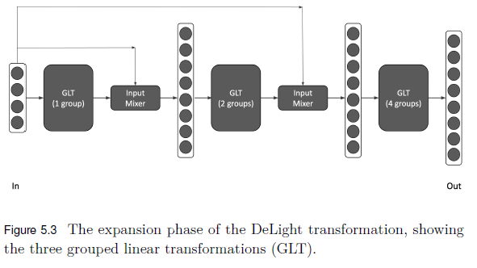

# Transformer Modifications

## Transformer block modifications

### Lightweight Transformers
#### Funnel-transformer
This model is a transformation of the original Tranformer architecture which takes the ouput of each layer and apply pooling before passes it to the next layer. This modification reduces the computational cost and allows to add nire kayers to support deeper models.

**Encoder**

So, if the output of a given layer is $h$ and the output of the pooling layer for that layer is $h' = Pooling(h)$ where $h \in \mathbb{R}^{T \times d}$ and $h' \in \mathbb{R}^{T' \times d}$, for some $T' < T$.

Before continuing, let's break the previous expressions to really really understand what is happening in a mathematical point of view.

Given a sequence of representations $h \in \mathbb{R}^{T \times d}$, where $T$ is the sequence length and $d$ is the dimensionality of each feature vector, a pooling operation is applied to reduce the sequence length. The resulting representation, denoted as $h' = \text{Pooling}(h)$, has a shape of $\mathbb{R}^{T' \times d}$, where $T' < T$. This reduction captures the most relevant information from the input sequence while retaining its dimensionality in the feature space ($d$). The pooling mechanism helps mitigate computational overhead and memory requirements in subsequent operations, especially when $T$ is large.

In the self-attention mechanism, the outputs $h'$ and $h$ play distinct roles. The reduced representation $h'$ is used to construct the query vectors and the residual connection in the self-attention block, highlighting its importance in summarizing the sequence for attention computation. Meanwhile, the original sequence $h$ is retained for constructing the key and value vectors, ensuring that the full sequence information is available for attention computations. This dual usage of $h'$ and $h$ strikes a balance between efficiency (via pooling) and preservation of sequence information for precise self-attention operations.
 
The equations below describe the construction of the query ($\mathbf{Q}$), key ($\mathbf{K}$), and value ($\mathbf{V}$) matrices for the self-attention mechanism:

1. **Query Matrix**:
   $$
   \mathbf{Q} = h'W_Q, \quad \mathbf{Q} \in \mathbb{R}^{T' \times d_k}
   $$

2. **Key Matrix**:
   $$
   \mathbf{K} = hW_K, \quad \mathbf{K} \in \mathbb{R}^{T \times d_k}
   $$

3. **Value Matrix**:
   $$
   \mathbf{V} = hW_V, \quad \mathbf{V} \in \mathbb{R}^{T \times d_v}
   $$

Here, $W_Q \in \mathbb{R}^{d \times d_k}$, $W_K \in \mathbb{R}^{d \times d_k}$, and $W_V \in \mathbb{R}^{d \times d_v}$ are learnable weight matrices. The dimensions $d_k$ and $d_v$ are the sizes of the projected spaces for the query/key and value representations, respectively. Notice that $h'$ (pooled representation) is used to generate the query matrix, whereas $h$ (original sequence) is used for the key and value matrices.

**Decoder**

The decoder in the Funnel-Transformer is designed to support token-level prediction tasks, such as machine translation, where the model needs to produce a full output sequence. To achieve this, the decoder includes an optional upsampling mechanism that expands the compressed encoder output back to the original sequence length. 

- **Understanding $M$ and $T_M$**
  1. What is $M$?  
     $M$ is the number of encoder layers applied to the input sequence. Each encoder layer compresses the sequence by reducing its length by a factor of 2 (or some other ratio). The more layers ($M$) applied, the shorter the compressed sequence becomes.

  2. What is $T_M$?  
     $T_M$ is the length of the sequence after $M$ encoder layers. The formula for $T_M$ is:  
     $$
     T_M = \frac{T}{2^{M-1}}
     $$
     Here:
     - $T$ is the length of the original input sequence.
     - Each encoder layer divides the sequence length by 2. For example:
       - After $M = 1$: $T_M = T$ (no compression yet).
       - After $M = 2$: $T_M = \frac{T}{2}$.
       - After $M = 3$: $T_M = \frac{T}{4}$.
       - After $M$-th layer: $T_M = \frac{T}{2^{M-1}}$.

     This means the deeper the encoder, the shorter the compressed sequence $T_M$.

- **Upsampling**
  Given the compressed sequence $h^{(M)}$ of length $T_M = \frac{T}{2^{M-1}}$, the decoder upsamples it back to the original sequence length $T$. Upsampling is achieved by repeating each hidden vector $2^{M-1}$ times. The upsampled sequence $h^{(\text{up})} = [h^{(\text{up})}_1, \ldots, h^{(\text{up})}_T]$ is defined as:

  $$
  h^{(\text{up})}_i = h^{(M)}_{\lfloor i / 2^{M-1} \rfloor}, \; \forall i = 1, \ldots, T
  $$

  Here:
  - $\lfloor i / 2^{M-1} \rfloor$ ensures that each vector in $h^{(M)}$ is repeated $2^{M-1}$ times to fill up the full length $T$.

- **Residual Connection**
  To address duplicate information introduced during the upsampling process, the Funnel-Transformer adds the hidden state output of the first encoder layer, $h^{(1)}$, to the upsampled sequence $h^{(\text{up})}$. This creates a residual connection:

  $$
  g = h^{(\text{up})} + h^{(1)}
  $$

  This combination helps retain finer-grained information from the original input sequence. After this step, a few additional transformer layers are applied on top of $g$ to allow the model to optimally combine features and improve the output sequence quality.

**Scaling**
The Funnel-Transformer significantly reduces computational complexity through its pooling mechanism, leading to a time complexity of $O(d \cdot T^2 + T \cdot d^2)$. As the sequence length $T$ is halved at each encoder layer, the overall complexity decreases by a factor of four per layer. Since the term $T \cdot d^2$ dominates, the model achieves a linear speedup compared to the quadratic complexity of standard transformers. This reduction allows for adding more encoder layers or increasing the feature dimensionality ($d$) without substantially increasing computational cost.

**Performance and versions**
Performance evaluations were conducted on three model sizes: large (24 layers, $d = 1024$), base (12 layers, $d = 768$), and small (6 layers, $d = 768$). When applied to text classification tasks like those in GLUE, the Funnel-Transformer outperformed standard transformers in most cases by leveraging its reduced sequence length and deeper architecture. However, for tasks like STS-B, where depth does not compensate for reduced sequence length, performance slightly declined.

#### DeLighT

DeLighT is a modified transformer that introduces a transformation on the input with a Trnasfomer block (DeLighT block) that is applied pefore projecting the $Q$, $K$ and $V$;

The Grouped Linear Transformation (GLT)  is a key technique used in the DeLighT block to efficiently process high-dimensional inputs while reducing the number of parameters and computational cost. GLT achieves this by dividing the input vector into smaller groups and applying linear transformations independently to each group, rather than transforming the entire vector at once. This grouped approach is inspired by ideas in grouped convolution, commonly used in computer vision, and is highly effective for scaling transformers.

**What does GLT do?**
1. **Dimensionality transformation**:
   - GLT can **expand or compress** the dimensionality of an input vector to suit different layers' requirements. For example:
     - In the **expansion phase**, GLT increases the input dimensionality from $d_{\text{in}}$ to a larger size $d_{\text{max}}$ to allow for richer representations:
       $$
       d_{\text{max}} = w_m \cdot d_{\text{in}}
       $$
       where $w_m$ is a width multiplier that scales the input.
     - In the **compression phase**, GLT reduces the dimensionality from $d_{\text{max}}$ to a smaller size $d_0$, typically:
       $$
       d_0 = \frac{d}{2}
       $$

2. **Parameter efficiency**:
   - By processing smaller groups of features independently, GLT reduces the number of learnable parameters compared to fully connected transformations. Instead of a large weight matrix of size $d_{\text{in}} \times d_{\text{out}}$, the parameters are reduced by dividing the input into $G$ groups.

3. **Feature diversity**:
   - GLT promotes **diverse representations** by applying transformations to groups and using an **Input Mixer** to shuffle features between groups. This ensures that information is shared across the entire feature space.

**How does GLT work?**
1. **Input grouping**:
   - The input vector of size $d_{\text{in}}$ is divided into $G$ groups. For example:
     - If the input has 512 features and there are 4 groups, each group will have $512 / 4 = 128$ features.
   
2. **Group-wise transformations**:
   - A separate linear transformation is applied to each group independently. If the transformation matrix for each group has size $d_{\text{group}} \times d_{\text{group}}$, the total parameter count is:
     $$
     G \cdot d_{\text{group}}^2
     $$
     which is much smaller than a fully connected transformation matrix of size $d_{\text{in}} \times d_{\text{out}}$.

3. **Feature mixing**:
   - After the group transformations, an **Input Mixer** is used to shuffle features between groups. This ensures that information from all groups is combined, improving the diversity and richness of the learned representations.

4. **Iterative application**:
   - Multiple GLT layers can be stacked. For instance, in the DeLighT block, the first $\lfloor N/2 \rfloor$ layers expand the dimensionality to $d_{\text{max}}$, while the remaining $N - \lfloor N/2 \rfloor$ layers compress it back to $d_0$. The overall structure is:
     - Expansion phase:
       $$
       d_{\text{in}} \xrightarrow{\text{GLT}} d_{\text{max}} = w_m \cdot d_{\text{in}}
       $$
     - Compression phase:
       $$
       d_{\text{max}} \xrightarrow{\text{GLT}} d_0 = \frac{d}{2}
       $$

**Shuffling and Residual Connections**:
- After each GLT, the Input Mixer shuffles features across groups, improving the diversity of features while ensuring efficient representation learning. A **residual connection** combines the input and transformed features to stabilize training.

**Performance Advantages**:
- DeLighT performs as well as or better than standard transformers, despite using fewer parameters.
- When given additional parameters, it can outperform standard transformers and achieve state-of-the-art performance on tasks like machine translation.

**Example**
Suppose we have an input vector of size 8, divided into 2 groups of size 4:

- Input Vector: [x1, x2, x3, x4, y1, y2, y3, y4]
- Group 1: [x1, x2, x3, x4]
- Group 2: [y1, y2, y3, y4]

After applying group-wise transformations within the GLT component, we get:

- Transformed Group 1: [x1', x2', x3', x4']
- Transformed Group 2: [y1', y2', y3', y4']

The **Input Mixer** shuffles the features across groups:

- Mixed Vector: [x1', y1', x2', y2', x3', y3', x4', y4']

Now the first group (Mixed Group 1) contains features from both original groups:

- Mixed Group 1: [x1', y1', x2', y2']
- Mixed Group 2: [x3', y3', x4', y4']

**Process**

The provided **diagram** (Figure 5.3) illustrates the **expansion phase** of the DeLighT transformation using three stages of GLT with different group configurations (1 group, 2 groups, and 4 groups). The following components of the diagram are key to understanding GLT and its functionality:
- **In**: Represents the $d_{\text{in}}$-dimensional input vector.
- **GLT (1 group)**: In this phase, the input vector is processed as a single group, and a linear transformation is applied to the entire input vector.
- **Input Mixer**: After the transformation, the input mixer shuffles the features between groups. This shuffling operation ensures effective interaction and mixing of features across groups, enhancing the representational capacity of the model.
- **GLT (2 groups)**: The next stage splits the input vector into 2 groups, and each group undergoes a separate linear transformation. This approach reduces the parameter count by dividing the input into smaller, independently transformed groups.
- **GLT (4 groups)**: In the final stage, the input is divided into 4 groups, with transformations applied independently to each group. The increased number of groups reduces redundancy and further decreases computational cost.
- **Out**: Represents the output vector of the transformation.

---

## Transformers with modified multi-head self-attention

---

## Modifications for training task efficiency

---

# Transformer submodule changes

